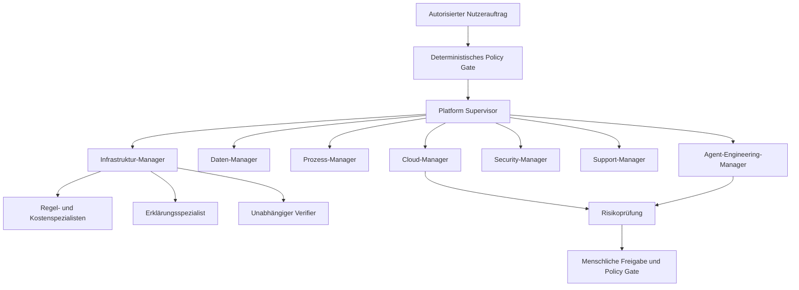

# Agentenhierarchie und kontrollierte Laufzeit

> Fortschreibung 10.09.2026: Der folgende Phase-0-Entwurf bleibt das Zielbild. Den konkreten Phase-1-Stand beschreiben [ADR 0002](adr/0002-phase1-runtime-and-contracts.md), [API-Verträge](API_CONTRACTS.md) und [Prüfbericht](testing/PHASE_1_REPORT.md). Entwurfswerte sind keine Laufzeitnachweise.

Status: ENTWURF. Architektur für M1–M7; kein Agent bereits implementiert.

## Verantwortlichkeiten

Das Diagramm ist die Zielhierarchie. In M1 existiert nur der Infrastrukturbereich. Supervisor und Manager sind zunächst deterministische Workflowkoordinatoren. Cost Estimator und Verifier sind Fachservices. Das ist eine bewusste Umsetzung des Mandats, LLMs nur bei tatsächlichem Nutzen einzusetzen.

Spätere Domänen bekommen Spezialisten mit unterschiedlichen schmalen Aufgaben; sie werden nicht vollständig untereinander vernetzt. Kontrollinstanzen erhalten eigene Prüfregeln und können Ergebnisse stoppen. Ein zweites LLM allein ist keine unabhängige Faktenprüfung.

## Agentenvertrag

Jede versionierte Definition enthält: name, purpose, responsibilities, allowed_tools, forbidden_actions, input_schema, output_schema, timeout, max_turns, max_tool_calls, retry_policy, token_budget, monetary_budget, failure_behavior, escalation_policy, prompt_version, model_route und policy_version.

AuthContext (Actor, Organisation, erlaubte Objektmenge) kommt ausschließlich aus dem Server. Das Modell kann ihn weder erweitern noch durch eigene Tenant-IDs ersetzen. Der Supervisor delegiert typisierte Aufgaben und sammelt typisierte Ergebnisse, keine unkontrollierten Gesprächsarchive.

ToolPermission ist die Schnittmenge aus Nutzerrechten, Mandantenscope, Agentenpolicy und Laufzeitbudget. Ein im Prompt genanntes Werkzeug ist noch kein erlaubtes Werkzeug.

## Phase 1 konkret

| Komponente | Eingang | Ausgang | Rechte |
| --- | --- | --- | --- |
| InfrastructureManager | autorisierter ScenarioSnapshot | AssessmentResult | deterministische Fachservices |
| CostEstimator | Plan + Katalogversion | Kostenzeilen, Summen, Lücken | lesen und rechnen |
| Verifier | Snapshot + Kandidaten + Rechenbeiträge | gültig/ungültig, Abweichungen | unabhängig prüfen, nichts genehmigen |
| DeterministicExplainer | verifiziertes Assessment | deutsche Vorlagenerklärung | keine Netzverbindung |
| Optionaler OpenAI-Erklärungsspezialist | minimierter EvidenceDTO | strukturierte deutsche Erklärung | keine Tools, kein Retrieval, kein SQL/Shell |

Die Offline-Erklärung ist eine echte regelbasierte Produktfunktion. Ein Test-Double simuliert separat Providerantworten in Tests. Beides wird nicht als live arbeitendes Sprachmodell ausgegeben.

Live-Provider: ausschließlich nach separatem Nutzeraufruf, Freigabe für die Datenübertragung und Serverkonfiguration. Eingang maximal 8.000 Tokens, Ausgang maximal 1.200 Tokens, ein Modelllauf, null Toolaufrufe, maximal 10 Sekunden Gesamtdauer, keine automatischen Retries in M1. Grenzen sind vorläufige Projektentscheidungen; Modell-/Tokenizer-Kompatibilität wird bei Integration geprüft.

Vor Aufruf wird gegen einen versionierten Modellpreiskatalog ein konservatives Budget reserviert. Bei fehlendem aktuellen Preis oder unbekannten Abrechnungsanteilen wird der kostenpflichtige Lauf nicht gestartet. Die Abrechnung bleibt providerabhängig; Kostenobergrenzen brauchen zusätzlich Anbieterlimits. Abbruch bedeutet nicht sicher null Kosten.

## Provider-Port

Die Anwendung verwendet ExplanationProvider.explain(EvidenceDTO, ExecutionBudget) → ExplanationResult. Implementierungen: deterministic für den Kern, test_double ausschließlich in Tests, openai für explizite Live-Aufrufe. OpenAI Agents SDK und Responses API werden innerhalb dieses Adapters gekapselt. Zentrale Modellrouten werden zur Laufzeit auf konkret erlaubte Modellkennungen aufgelöst und pro Lauf festgehalten.

Der Master nennt keine dauerhaft verbindliche Laufzeit-Modellkennung. Die Empfehlung eines Codex-Modells im Begleittext wird nicht als Modellkonfiguration der Plattform übernommen. SDK- und Modelländerungen brauchen Vertrags- und Evaluationstests.

Das Manager-Muster mit begrenzten Spezialisten ist durch die offiziellen Orchestrierungsoptionen unterstützt. Die konkrete Verwendung deterministischer Manager ist unsere eigene Vereinfachung. [OpenAI: Orchestration and handoffs](https://developers.openai.com/api/docs/guides/agents/orchestration).

## Ausgabekontrolle und Fehler

ExplanationResult enthält kurze Aussagen mit evidence_ids sowie assumptions, uncertainties und suggested_next_steps. Zahlen werden aus den Originaldaten gerendert; das Modell schreibt keine maßgeblichen Kostenfelder. Schemafehler, fremde Beleg-IDs und unzulässige Fakten führen zu verworfener Erklärung. Freie semantische Behauptungen lassen sich nicht vollständig deterministisch beweisen; der Text bleibt als KI-Erklärung gekennzeichnet und wird evaluiert.

Bei Timeout, Rate Limit, Kostenlimit oder ungültigem Output bleibt das geprüfte Assessment verfügbar; die UI zeigt „KI-Erklärung nicht verfügbar“ samt sicherem nächsten Schritt. Der Status des Providerlaufs dokumentiert den Fehler. Providerdiagnosen enthalten keine Zugangsdaten.

Guardrails und SDK-Unterbrechungen können unterstützen. Autorisierung und Freigabe werden vor Ausführung vom Anwendungscode erzwungen; sie werden nicht durch einen probabilistischen Klassifikator ersetzt. [OpenAI: Guardrails and human review](https://developers.openai.com/api/docs/guides/agents/guardrails-approvals).

## Freigaben ab späteren Modulen

Plan → Review → Approve → Apply ist ein Zustandsautomat mit atomarem einmaligem Verbrauch der Freigabe. Gespeichert werden Actor, Organisation, Tool-/Agentenversion, Scope, kanonischer Payloadhash, Evidenz, Gültigkeitsende und Freigebender. Bei geänderten Daten, Rechten oder Parametern wird die Freigabe ungültig; unmittelbar vor Ausführung erneut prüfen.

In M1 werden keine externen Änderungen angeboten. Ab M2 bindet eine Transformation die Vorschau an Originalhash und Planversion. Cloud-Adapter bleiben in M4 lesend; ein späteres Apply benötigt eine eigene umgesetzte Freigabe- und Wiederanlaufstrecke. Support versendet keine Nachrichten selbstständig.

## Nachweise und Datenschutz

Lokal speichern: Run-ID, Manager-/Agentenversion, Provider-/Modellroute, minimierte Inputreferenzen, schema-validierte Ausgaben, Evidenz, Toolmetadaten, Entscheidungen, Fehler, Dauer, Nutzung, Budget und Freigaben. Keine verborgenen Gedankengänge.

In Phase 1 und CI ist externer Traceexport immer deaktiviert. Eine spätere Aktivierung ist eine eigene Erweiterung mit erneuter Datenflussprüfung. Logging/Tracing erhalten Allowlisten statt pauschaler Payloadaufzeichnung. Eine ausdrücklich freigegebene Exportkonfiguration muss Datenklassifikation und Empfänger berücksichtigen. Das SDK bietet Trace-Funktionen; deren Nutzung ist von unserer lokalen Auditpersistenz getrennt. [OpenAI: Integrations and observability](https://developers.openai.com/api/docs/guides/agents/integrations-observability).

Modellwahl erfolgt ausdrücklich über Konfiguration, nicht über einen wechselnden SDK-Default. [OpenAI: Models and providers](https://developers.openai.com/api/docs/guides/agents/models). Datenaufbewahrungsoptionen sind vor Live-Nutzung am tatsächlich verwendeten Konto und Endpoint zu prüfen; ein lokaler Schalter garantiert keine umfassende Löschzusage. [OpenAI: Data controls](https://developers.openai.com/api/docs/guides/your-data).

## Evaluation und Weiterentwicklung

P1 prüft Zahlenkonsistenz, Schema, Belegbezug, deutsche Darstellung, Ablehnung unzulässiger Behauptungen, Prompt-Injection, Rechte zur Datenübertragung, Budget-/Tokenlimits, Timeout und sichere Degradation (SEC-10, SEC-11, SEC-21). Mit tatsächlich eingeführten Tools und mehreren Domänen kommen Routing-, Toolwahl- und Toolberechtigungstests hinzu. Fest definierte synthetische Fälle werden versioniert.

Feedback → kuratierter Evaluationsfall → Vorschlag → Tests → unabhängige Prüfung → menschliche Freigabe → neue Version. Factory-Versionen durchlaufen DRAFT, VALIDATION, EVALUATION, HUMAN_APPROVAL, ENABLED oder REJECTED. Abgelehnte Versionen bleiben auditiert. Kein Agent überschreibt seine eigene Produktionskonfiguration.

Quellenprüfung: 09.09.2026; dies ist kein Live-API-Kompatibilitätsnachweis.

## M2-Erweiterung vom 14.09.2026

Der Datenplanungsablauf setzt Supervisor → Data Manager → Cleaning Specialist → Verifier → Risk Reviewer → Cost Estimator → Approval Gate konkret um. Verantwortlichkeiten sind deterministische Kontrollstellen im Router/Planer/Verifier und im bestehenden Vorschau-/Versionsworkflow; die Rollenanzeige behauptet keine unabhängigen Live-KI-Agenten. Nur der optionale Cleaning-Adapter nutzt einen einzelnen strukturierten OpenAI-Aufruf. Seine Ausgabe besteht ausschließlich aus zugelassenen Kandidaten-IDs. Keine Shell, kein SQL, keine freien neuen Schritte und keine automatische Datenänderung. Zustimmung, Organisationsfreigabe, Zeit-/Token-/Budgetgrenzen und Versionshash sind Anwendungskontrollen. [ADR 0014](adr/0014-datenanalyse-quellen-und-gepruefte-plaene.md), [tatsächliche Nachweise](testing/M2_COMPLETION_REPORT.md). M3 und spätere Agentenmodule bleiben unbegonnen.
