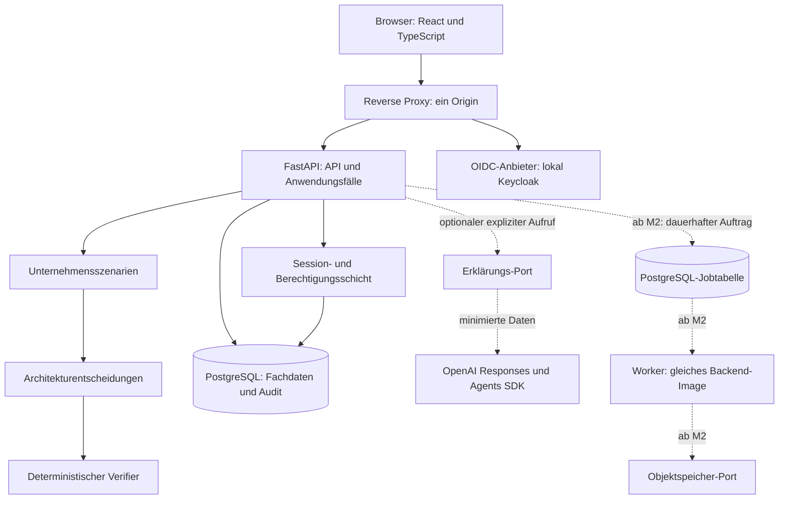

# Systemarchitektur

> Fortschreibung 10.09.2026: Der folgende Phase-0-Entwurf bleibt das Zielbild. Den konkreten Phase-1-Stand beschreiben [ADR 0002](adr/0002-phase1-runtime-and-contracts.md), [API-Verträge](API_CONTRACTS.md) und [Prüfbericht](testing/PHASE_1_REPORT.md). Entwurfswerte sind keine Laufzeitnachweise.

Stand: 09.09.2026. Status: ENTWURF für die gemeinsame Durchsicht; keine Komponente implementiert.

## Systemgrenze und erste Nutzerreise

Die Unternehmensplattform ist eine mandantenfähige Webanwendung. Beschäftigte erfassen Szenarien, vergleichen belegte Alternativen und prüfen Ergebnisse. Der Betreiber verantwortet Laufzeit, Identität, Datensicherung und freigegebene Verbindungen. Externe Identitäts-, KI- und Cloud-Anbieter bilden eigene Vertrauensbereiche.

Der erste komplette Ablauf ist in [Phase 1](PHASE_1_SPEC.md) spezifiziert: Anmeldung, Unternehmensprofil mit Anforderungen, reproduzierbare Bewertung, überprüfter Vergleich und Wiederaufruf eines gespeicherten Ergebnisses.

## Bausteine

API und Worker gehören zum gleichen deploybaren Backend und besitzen dieselben fachlichen Verträge. Der Worker ist ein anderer Prozess für Zeit- und Ressourcenisolation, kein unabhängiger Microservice. Phase 1 benötigt für den deterministischen Kern keinen Worker, Redis oder Objektspeicher.

## Modulgrenzen und Abhängigkeiten

Der gemeinsame Kern enthält IDs, Zeit-/Geldtypen, Fehlerverträge, AuthContext und Audit-Schnittstellen. Fachmodelle gehören in ihre Domäne. Die Module sprechen über versionierte DTOs und Anwendungsservices; fremde ORM-Modelle werden nicht direkt importiert. Modulinterne Transaktionen dürfen mehrere Tabellen derselben fachlichen Änderung atomar schreiben.

| Modul | Verantwortung | Verwendet |
| --- | --- | --- |
| Identität und Richtlinien | Session, Mitgliedschaft, Rollen, Freigaben | OIDC, PostgreSQL |
| A Intake | Profile, Arbeitslasten, Anforderungen, Versionen | Identität |
| B Entscheidungen | Kompatibilität, harte Grenzen, Scores, TCO, Vergleich | A-Snapshots, Kataloge |
| G Agenten | begrenzte Ausführung und erklärte Ergebnisse | Fachservices über Ports |
| C Daten | Import, Profiling, Transformation, Lineage | Identität, Jobs, Objektspeicher |
| D Prozesse | Event-Verträge, KPIs, Verbesserungshypothesen | explizite C-Ergebnisse |
| E Cloud | lesendes Inventar, Kosten und Resilienz | A/B, autorisierte Adapter |
| F Sicherheit | Scope, Scannerbelege, Findings, Prüfung | isolierte Scanner, Jobs |
| I Support | freigegebenes Wissen und Eskalation | Retrieval mit ACL, G |
| H Factory | versionsgebundene Agentendefinitionen | G, Evaluation, Freigaben |
| J Hilfe | kontextbezogenes Erklären und Lernen | serverseitig geprüfter UI-Kontext |

Die [Domänenkarte](modules/DOMAIN_MAP.md) beschreibt alle späteren Erweiterungen. Extraktion eines Diensts erst bei nachgewiesen unterschiedlichen Skalierungs-, Freigabe- oder Isolationsanforderungen; dann eigenes ADR und belastbare Betriebsverantwortung.

## Requests, Persistenz und Fehler

1. Der Proxy begrenzt Anfragen und führt zum Backend. Die SPA und API verwenden denselben Origin.
2. OIDC Authorization Code mit PKCE bestätigt Identität. Tokens verbleiben serverseitig; der Browser erhält eine zufällige opaque Session im geschützten Cookie.
3. Die begrenzte Rolle platform_auth löst Session und aktuelle Mitgliedschaft auf. Anschließend öffnet platform_app eine kurze Transaktion mit validiertem Tenant-Kontext.
4. RBAC und Objektbesitz werden im Service geprüft; RLS und mandantengebundene Fremdschlüssel begrenzen Datenbankzugriffe zusätzlich. Migrationen verwenden eigene Zugangsdaten.
5. Profile und Entscheidungsstände sind versioniert. Die Bewertung speichert Eingabesnapshot, Regel-/Katalogversion, Einzelbeiträge, Evidenz, Verifier-Ergebnis und Audit atomar.
6. Erst nach Commit ist ein erfolgreiches Ergebnis sichtbar. Bei Audit-/DB-Fehlern wird die zugehörige Mutation zurückgerollt; keine Teilentscheidung als Erfolg.
7. Eine optionale KI-Erklärung ist ein eigener begrenzter Aufruf nach dem gespeicherten Ergebnis. Fehlschlag verändert das Ergebnis nicht.

Kein HTTP-Request vertraut einem Tenant-Feld aus dem Body. Ungültige Eingaben ergeben strukturierte 422-Fehler, fehlende Anmeldung 401, verbotene Aktionen 403; fremde bzw. nicht sichtbare Objekt-IDs 404. Versionskonflikte ergeben 409. Details: [API-Verträge](API_CONTRACTS.md), [Datenmodell](DATA_MODEL.md).

## Authentifizierung und Rollen

Ein lokal mitgelieferter OIDC-Anbieter vermeidet einen eigenen Passwort- und Recovery-Stack. Keycloak verursacht zusätzlichen RAM- und Konfigurationsbedarf; dieser wird bewusst akzeptiert und im M1-Login-Smoke-Test geprüft. Produktion kann denselben OIDC-Port an einen vorhandenen Firmenanbieter anbinden.

Org-Admin verwaltet Mitglieder seiner Organisation; Analysten bearbeiten freigegebene Szenarien; Viewer lesen; Plattformadministration erhält nicht automatisch alle Fachdaten. In M1 sind Org-Admin, Architektur-Analyst und Viewer aktiv; weitere Rollen werden erst mit ihren Modulen freigeschaltet. Organisationsmitgliedschaften und Anwendungspolicies bestimmen Rechte, nicht ungeprüfte IdP-Rollenclaims.

## Hintergrundarbeit ab M2

API und Auftrag werden in derselben DB-Transaktion gespeichert. Ein Worker beansprucht begrenzte Batches mit Lease und Heartbeat; nach Ablauf ist Wiederaufnahme möglich. Verarbeitung ist mindestens einmal, fachliche Veröffentlichung idempotent über einen stabilen Schlüssel. Der Status ist QUEUED, RUNNING, WAITING_FOR_APPROVAL, SUCCEEDED, FAILED oder CANCELLED.

Worker hält keine DB-Transaktion während externer Aufrufe offen. Output entsteht zunächst separat und wird erst nach erneuter Autorisierung/Versionsprüfung veröffentlicht. Abbruch ist kooperativ, mit Timeouts und Ressourcenlimits. Unklarer Ausgang eines späteren externen Schreibzugriffs führt zur Abstimmung mit dem Zielsystem, nicht zum blinden Retry. PostgreSQL ist zunächst ausreichend; Queue-Metriken begründen einen späteren Broker.

## Sicherheit und Daten

[Threat Model](security/THREAT_MODEL.md) und [Vertrauensgrenzen](security/TRUST_BOUNDARIES.md) sind Teil dieser Architektur. RLS ist eine zusätzliche Schranke gegen fehlende Filter; eine vollständig kompromittierte API kann weiterhin mit ihren Rechten handeln. Hochsensitive spätere Mandanten können stärkere Datenbank-/Deploymentisolation erfordern.

Uploads sind ab M2 untrusted, größenbegrenzt und außerhalb von Webprozessen zu analysieren. CSV-Exporte entschärfen Tabellenformeln. Retrieval filtert ACLs vor der Suche und prüft sie vor Ausgabe erneut. Keine Rohprompts/Secrets in Telemetrie, keine gespeicherten verborgenen Gedankengänge. Audit enthält ausgewählte strukturierte Nachweise, keine pauschalen Payloadkopien.

## Betrieb und Qualitätsziele

- Entwicklung: ein Host, Docker Compose, persistente Volumes; Linux-Container auf Windows/macOS/Linux.
- Vorläufiges Messprofil M1: 10 parallele Nutzer, bis 100 Szenarien je Organisation, 10 Arbeitslasten und 20 vollständige unterstützte Kandidatenpläne je Bewertung. Das sind Testgrenzen, keine gemessene Kapazität.
- Ziel im dokumentierten Referenzsystem: p95 Lesen unter 500 ms, deterministische Bewertung unter 2 s; Live-KI separat begrenzt und nicht Bestandteil dieses SLO.
- Liveness prüft Prozess; Readiness prüft notwendige DB/Schema-Voraussetzungen. LLM-Ausfall macht den Kern nicht unbereit.
- Strukturierte Logs korrelieren request_id, organization_id (soweit zulässig), assessment_id, job_id und agent_run_id. Metriken erfassen Fehler, Dauer, Queuealter und Providerbudget.
- Backups müssen durch Wiederherstellung geprüft werden. Ziel-RTO/RPO des Produkts sind von RTO/RPO der vom Nutzer bewerteten Firmenarbeitslasten zu unterscheiden; Produktionsziele werden mit dem Betreiber festgelegt.

## Bewusste Vereinfachungen

Kein SSR, weil die authentifizierte Arbeitskonsole keine Suchmaschinenoptimierung benötigt. Keine Microservices, Kafka, Kubernetes, Redis oder Vektordatenbank in M1. Keine autonome Cloud-Anwendung, kein frei ausführender Agent und keine Produktiv-Selbständerung.

Die Technologiewahl samt Versionsnachweisen steht in der [Technologiematrix](TECHNOLOGY_MATRIX.md); Entscheidungsgründe in [ADR 0001](adr/0001-system-architecture.md).

## Implementierter M2-CSV-Ablauf

Seit 11.09.2026 ergänzt das Modul data die bestehende Plattform: React-Datenwerkstatt → autorisierte API → PostgreSQL-Auftrag → eigener begrenzter Worker → gespeicherte Vorschau → bewusste Versionsbestätigung → Export. Es gibt keinen KI-Aufruf in diesem Ablauf.

Der Worker verwendet dasselbe Python-Image, aber ausschließlich das interne Datennetz und die Anwendungsrolle. Mandanten werden vom Betreiber explizit konfiguriert; Modelltexte oder Dateiinhalte können diese Liste nicht erweitern. Kleine Blobs werden über den tatsächlich genutzten Speicherport in PostgreSQL abgelegt. Die technischen Entscheidungen und Erweiterungsgrenzen dokumentiert [ADR 0005](adr/0005-bounded-csv-data-workflow.md).

## Implementierte Erweiterung: große CSV-Dateien

Der Nutzerauftrag vom 12.09.2026 ersetzt die kleinen CSV-Demogrenzen. 1-GiB-Originale werden in 4-MiB-Requests angenommen und in mandantengebundenen PostgreSQL-Abschnitten gespeichert. Ein Worker mit Lease und Fortschritt verarbeitet die Daten über Dateien und SQLite mit begrenztem Cache. Indizierte JSONL-Versionen ermöglichen Seitenzugriff; fertige sichere CSV-Exporte werden gestreamt. Alte Blobs und Versionen bleiben lesbar. Die Entscheidung und Grenzen stehen in [ADR 0006](adr/0006-gib-csv-streaming.md).
