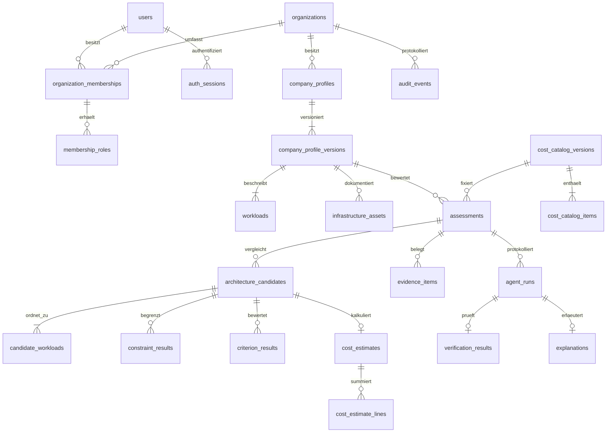

# Datenmodell, Persistenz und Datenintegrität

> Fortschreibung 10.09.2026: Der folgende Phase-0-Entwurf bleibt das Zielbild. Den konkreten Phase-1-Stand beschreiben [ADR 0002](adr/0002-phase1-runtime-and-contracts.md), [API-Verträge](API_CONTRACTS.md) und [Prüfbericht](testing/PHASE_1_REPORT.md). Entwurfswerte sind keine Laufzeitnachweise.

Stand: 09.09.2026 · Phase 0 · **Entwurf für Phase 1; noch keine Tabellen oder Migrationen implementiert.**

Das Modell verwendet PostgreSQL, SQLAlchemy und Alembic. Es trennt Identität, versionierte Erfassung, deterministische Bewertung, Kosten, Evidenz und ergänzende Erklärungen. Die nachstehenden Tabellen werden nur angelegt, wenn sie im ersten vertikalen Ablauf tatsächlich verwendet und getestet werden. Weitere Entitäten des Master-Mandats bleiben im Abschnitt „Spätere Erweiterungen“ dokumentiert.

## 1. Modellentscheidungen

- Ein Mandant kann mehrere Unternehmensszenarien besitzen. Jeder Speichervorgang erzeugt eine unveränderliche Profilversion mit eigenen Workloads und Assets. Das vermeidet unbemerkte Änderungen bereits bewerteter Eingaben.
- Ein Assessment fixiert Profilversion, normalisierte Eingaben, Gewichte, Annahmen, Kompatibilitätsmatrix, Regeln, Kostenkatalog, Rechenalgorithmus und deren Inhalts-Hashes. Eine neue Bewertung erzeugt einen neuen Datensatz.
- Architekturpläne bestehen aus vollständigen Workload-Zuordnungen. Service-Modell, Bereitstellungsmodell und Betriebsort stehen in getrennten Spalten. Ausschlussbedingungen, Kriterien und Kostenzeilen bleiben getrennt abfragbar.
- Der erste Katalog enthält ausschließlich gekennzeichnete synthetische Demowerte in EUR. Seine Versionierung wird in P1 implementiert; die Preise sind ausdrücklich keine Marktdaten. Tenant-eigene Katalogkopien vermeiden eine globale Lesefreigabe innerhalb der Fach-RLS.
- Manager, Kostenberechnung und Verifier sind deterministisch. Optionale LLM-Erklärungen besitzen eigene Datensätze und dürfen ein abgeschlossenes Ergebnis nicht verändern.
- Rollen und Berechtigungszuordnung sind in P1 eine versionierte Codepolicy. Die DB speichert Mitgliedschaften und Rollenvergabe; editierbare `roles`-/`permissions`-Tabellen werden erst bei tatsächlichem Bedarf ergänzt.

## 2. Konventionen

Die folgende Notation ist verbindlich für den Migrationsentwurf:

| Kürzel | Festlegung |
|---|---|
| `T` | `id uuid PRIMARY KEY`, `organization_id uuid NOT NULL REFERENCES organizations(id) ON DELETE RESTRICT`, `created_at timestamptz NOT NULL DEFAULT now()`, `UNIQUE (organization_id, id)` |
| `M` | `updated_at timestamptz NOT NULL`, `revision integer NOT NULL CHECK (revision > 0)` für tatsächlich veränderliche Aggregate |
| `?` | Spalte ist nullable; alle anderen aufgeführten Spalten sind `NOT NULL` |
| `actor_user_id` | `uuid?`; zusammengesetzter FK `(organization_id, actor_user_id)` auf Mitgliedschaft; `NULL` nur bei ausdrücklich angegebenem Systemakteur |
| `hash` | `bytea` mit `CHECK (octet_length(value) = 32)`; SHA-256 des kanonisch serialisierten, schema-versionierten Inhalts |
| Status/Enum | `text` mit benanntem `CHECK`; keine frei erfundenen Werte, Änderungen über Migration |
| Geld | `numeric(20,6)` für Beträge/Einheitspreise, nicht `float`; Rundung im Fachmodell mit dokumentierter Regel |
| Mengen | `numeric(20,6)`, zusätzlich `CHECK (value >= 0)`; Endbeträge erst nach Multiplikation runden |
| Zeit | UTC in `timestamptz`; Dauern als nicht negative Ganzzahl in Sekunden; Nutzeranzeige lokalisiert |
| FK | Standard `ON DELETE RESTRICT`; fachliche Kindbeziehungen immer mit Mandant und, soweit nötig, Assessment-/Profilversionskennung |

UUIDs werden serverseitig erzeugt. DB-Defaults sind kein Ersatz für API-Validierung. Texte erhalten explizite Längenlimits in DTO und DB, etwa Namen 1–200, Freitextfelder bis 4.000 Zeichen. Größere JSONB-Objekte erhalten eine definierte Größenobergrenze im Request und zusätzlich in der Persistenzschicht. `NULL` bedeutet unbekannt oder nicht erfasst; es wird weder zu `0` noch zu „nicht relevant“ umgedeutet.

Jede Fach-Tabelle mit `T` erhält RLS. Alle sekundären Indizes beginnen bei mandantenbezogenen Suchmustern mit `organization_id`. SQLAlchemy-Beziehungen dürfen niemals nur über die UUID eines fremden Mandanten joinen. Für jede unten beschriebene Kind-FK wird ein gleich geordneter Index angelegt, sofern kein PK-/UNIQUE-/anderer vorhandener Index dieses Präfix bereits abdeckt; Duplikatindizes werden vermieden.

## 3. Beziehungen des ersten Schnitts



Die Pfeile sind fachliche Kardinalitäten; zusammengesetzte Mandanten-FKs sind aus Gründen der Lesbarkeit nicht einzeln eingezeichnet. Ein noch nicht bewertetes Szenario darf null Assessments haben. Ein Assessment ohne zulässige Alternative darf null empfohlene Kandidaten haben.

## 4. Identität und Mandanten

Identität wird anhand des vom konfigurierten OIDC-Aussteller bestätigten Paars `issuer`/`subject` verknüpft. E-Mail und Anzeigename sind veränderliche Attribute und kein Kontoschlüssel. Die OIDC-Spezifikation definiert `sub` als innerhalb des Issuers eindeutige, nicht neu zugewiesene Kennung; validiert werden unter anderem Aussteller, Zielgruppe, Ablauf und Nonce. [OpenID Connect Core](https://openid.net/specs/openid-connect-core-1_0.html)

### `organizations` — Plattformzugriff

Felder: `id uuid PK`, `name varchar(200)`, `slug varchar(80) UNIQUE`, `status text CHECK IN ('ACTIVE','SUSPENDED','ARCHIVED')`, `created_at`, `updated_at timestamptz`, `revision integer > 0`.

Mandanten werden in P1 durch die kontrollierte Demo-/Administrationsprovisionierung angelegt. Ein erfolgreicher OIDC-Login erzeugt keine beliebige Organisation und vergibt keine Administratorrolle. Der Anwendungspfad liest die aktive eigene Organisation; globale Mandantenlisten sind nur für ausdrücklich berechtigte Administration vorgesehen.

### `users` — Identitätsgrenze

Felder: `id uuid PK`, `oidc_issuer varchar(512)`, `oidc_subject varchar(255)`, `display_name varchar(200)?`, `email varchar(320)?`, `status text CHECK IN ('ACTIVE','DISABLED','PSEUDONYMIZED')`, `auth_epoch integer CHECK >= 0`, `created_at`, `updated_at timestamptz`; `UNIQUE (oidc_issuer, oidc_subject)` mit exaktem, case-sensitivem Vergleich. Keine Passwort-, ID-Token-, Access-Token- oder Refresh-Token-Spalten.

`auth_epoch` erlaubt serverseitige Ungültigmachung aller Sessions. E-Mail ist weder UNIQUE noch Voraussetzung für eine Mitgliedschaft. IdP-Account-Linking über unterschiedliche Issuer ist später eine gesonderte verifizierte Verwaltungsfunktion; es erfolgt niemals automatisch aufgrund gleicher E-Mail.

### `organization_memberships` — Plattformzugriff

Felder: `organization_id uuid FK organizations`, `user_id uuid FK users`, `status text CHECK IN ('ACTIVE','REVOKED')`, `joined_at timestamptz`, `revoked_at timestamptz?`, `revision integer > 0`; `PRIMARY KEY (organization_id, user_id)`. Check koppelt `REVOKED` an gesetztes `revoked_at`. Index `(user_id, status, organization_id)` dient der Auswahl erreichbarer Mandanten nach Login.

Mitgliedschaften werden widerrufen, nicht aus einem historischen Audit herausgelöscht. Fachliche Akteurs-FKs bleiben damit stabil. Mitgliedschaft allein genügt nicht für Schreibaktionen; der Dienst prüft die passende Rollenberechtigung.

### `membership_roles` — Plattformzugriff

Felder: `organization_id uuid`, `user_id uuid`, `role_code text`, `granted_at timestamptz`, `granted_by_user_id uuid?`, `grant_actor_type text CHECK IN ('USER','SYSTEM')`; PK `(organization_id, user_id, role_code)`; FK `(organization_id,user_id)` und nullable `(organization_id,granted_by_user_id)` auf Mitgliedschaft. Check verlangt eine Person für `USER`, sonst `NULL`.

Geplante P1-Codes: `ORG_ADMIN`, `ARCHITECTURE_ANALYST`, `VIEWER`. Die Codepolicy erlaubt `ARCHITECTURE_ANALYST` Erfassung und Bewertung, `VIEWER` lesenden Zugriff, `ORG_ADMIN` zusätzlich die Mitgliedschaftsverwaltung. `PLATFORM_ADMIN` ist keine pauschale Tenant-Rolle; operative Administration läuft separat. Weitere Mandatsrollen werden mit ihren Modulen eingeführt. Entzug einer Rolle entfernt diese aktuelle Zuordnung und schreibt gleichzeitig ein Audit-Ereignis. Die Organisationszeile wird bei administrativen Änderungen gesperrt; eine Transaktion darf die letzte aktive Organisationsadministrator-Mitgliedschaft nicht entfernen oder entmachten.

### `auth_sessions` — ausschließlich Identitätsgrenze

Felder: `id uuid PK`, `session_token_hash bytea UNIQUE`, `user_id uuid FK users`, `active_organization_id uuid?`, `csrf_secret_hash bytea`, `auth_epoch integer >= 0`, `created_at`, `last_seen_at`, `idle_expires_at`, `absolute_expires_at timestamptz`, `revoked_at timestamptz?`. Beide Hashfelder sind 32 Bytes. FK `(active_organization_id,user_id)` auf Mitgliedschaft. Check `created_at <= last_seen_at <= absolute_expires_at` und `idle_expires_at <= absolute_expires_at`; Ablauf wird zur Laufzeit gegen die aktuelle Zeit geprüft. Indizes `(user_id, revoked_at)` und `(absolute_expires_at)`.

Der Browser erhält ein zufälliges opakes Session-Cookie mit mindestens 256 Bit kryptografischem Zufall, keine DB-ID und keine OIDC-Tokens. Rohes Session- oder CSRF-Geheimnis wird nicht in der DB gespeichert. Die P1-Vorgabe beträgt 30 Minuten ohne Aktivität und höchstens acht Stunden absolute Lebensdauer. Sessions sind zunächst benutzergebunden; erst die explizite Auswahl einer aktiven Mitgliedschaft setzt `active_organization_id`. Ein Mandantenwechsel wird serverseitig validiert und auditiert; alte Session und alter CSRF-Token werden atomar widerrufen und ersetzt. Auch Login/Privilegwechsel rotieren die Session; Logout setzt `revoked_at`. Rollen werden pro Request aus der aktuellen Mitgliedschaft geladen, nicht aus einem dauerhaften Cookie behauptet. `HttpOnly`, `Secure`, `SameSite` und CSRF-Prüfung werden im Sicherheitskonzept konkretisiert.

### `oidc_login_attempts` — ausschließlich Identitätsgrenze

Felder: `id uuid PK`, `state_hash bytea UNIQUE`, `nonce_hash bytea`, `browser_binding_hash bytea`, `pkce_verifier_ciphertext bytea`, `encryption_key_id varchar(80)`, `return_path varchar(512)`, `created_at`, `expires_at timestamptz`, `consumed_at timestamptz?`; Hashlängen 32 Bytes; `expires_at > created_at`; Index `(expires_at)`.

Diese kurzlebige Tabelle ist der serverseitige Speicher für OIDC Authorization Code + PKCE, einschließlich Bindung an den initiierenden Browser. `return_path` ist ausschließlich ein validierter lokaler Pfad. Der PKCE-Verifier wird authentifiziert verschlüsselt gespeichert; der Schlüssel liegt als Laufzeitgeheimnis außerhalb der DB. Callback verbraucht `state` atomar genau einmal. Abgelaufene oder verbrauchte Versuche werden durch begrenzte periodische Wartung entfernt. Das ist keine generische Jobqueue und benötigt kein Redis.

### `auth_events` — append-orientiertes Authentifizierungsprotokoll

Felder: `id uuid PK`, `occurred_at timestamptz`, `event_type varchar(80)`, `outcome text CHECK IN ('SUCCESS','DENIED','ERROR')`, `user_id uuid? FK users`, `organization_id uuid? FK organizations`, `session_id uuid?`, `request_id uuid`, `reason_code varchar(80)?`, `metadata jsonb` mit festem schema-versioniertem, redigiertem Objekt. Indizes `(occurred_at DESC,id)` und `(user_id,occurred_at DESC)`.

`session_id` ist eine nicht auflösende Korrelationskennung ohne FK, damit Sessionbereinigung Authentifizierungshistorie nicht zerstört. Es werden keine Cookie-/Tokenwerte, rohen Login-Claims, Passwörter oder vollständigen IP-/Browserprofile gespeichert. Der konkrete Metadaten-Allowlist-Umfang ist Bestandteil der Security-Tests. Die Tabelle löst den notwendigen Sonderfall „fehlgeschlagener Login ohne Mandant“ und ist kein RLS-freies Fachereignisarchiv.

## 5. Versionierte Unternehmenserfassung

### `company_profiles` — Modul A

Felder: `T + M`, `name varchar(200)`, `description varchar(2000)?`, `status text CHECK IN ('ACTIVE','ARCHIVED')`, `created_by_user_id uuid`, `archived_at timestamptz?`. FK `(organization_id,created_by_user_id)` auf Mitgliedschaft. Check koppelt `ARCHIVED` an gesetztes Datum. Index `(organization_id,status,updated_at DESC,id)`.

Eine Organisation kann mehrere ähnlich benannte Szenarien haben; Namen sind keine Schlüssel. Der aktuelle Versionsstand wird aus der höchsten `version_no` gelesen. Kein zyklischer `current_version_id`-FK, der beim ersten Anlegen oder Löschen aufwendig nachgeführt werden müsste.

### `company_profile_versions` — Modul A, nach Commit unveränderlich

Felder: `T`, `company_profile_id uuid`, `version_no integer > 0`, `schema_version varchar(40)`, `content_hash bytea`, `created_by_user_id uuid`, `change_note varchar(2000)?`, `industry_code varchar(80)?`, `employee_count integer? >= 0`, `it_staff_fte numeric(8,2)? >= 0`, `monthly_budget numeric(20,6)? >= 0`, `initial_budget numeric(20,6)? >= 0`, `currency char(3) CHECK = 'EUR'`, `capex_preference text CHECK IN ('CAPEX','OPEX','BALANCED','UNKNOWN')`, `annual_growth_percent numeric(7,3)? CHECK BETWEEN -100 AND 1000`, `remote_work_percent numeric(5,2)? CHECK BETWEEN 0 AND 100`, `cloud_experience text CHECK IN ('NONE','BASIC','EXPERIENCED','UNKNOWN')`, `context jsonb`, `input_provenance jsonb`.

FK `(organization_id,company_profile_id)` auf Profile sowie Akteurs-FK auf Mitgliedschaft. `UNIQUE (organization_id,company_profile_id,version_no)` und `UNIQUE (organization_id,company_profile_id,id)`. Index zur neuesten Version `(organization_id,company_profile_id,version_no DESC)` ist durch den UNIQUE-Baum rückwärts nutzbar.

`context` ist ein streng validiertes `CompanyContextV1`: Standorte mit Landescode, Geschäftsziele, Fähigkeiten mit Niveau, aktuelle Anbieter, Netzstruktur und regulatorische Vorgaben als begrenzte Listen/Unterobjekte. Abfragbare Bewertungswerte stehen in Spalten/Workloads; das Objekt ist kein Ablageplatz für beliebige Fremdentitäten. `input_provenance` ordnet Eingabepfade den Kategorien `USER_INPUT`, `SYNTHETIC_DEMO`, `ASSUMPTION` und optional einem kurzen Herkunftshinweis zu. Ein angenommenes Budget erscheint nie als verifizierte Unternehmensangabe.

### `workloads` — Modul A, Teil einer Profilversion

Felder: `T`, `profile_version_id uuid`, `workload_key varchar(80)`, `name varchar(200)`, `workload_type text CHECK IN ('BUSINESS_APP','WEB_APP','DATABASE','FILE_STORAGE','ANALYTICS','OTHER')`, `description varchar(4000)?`, `user_count integer? >= 0`, `vcpu_count numeric(12,3)? >= 0`, `memory_gib numeric(20,6)? >= 0`, `storage_gib numeric(20,6)? >= 0`, `monthly_egress_gib numeric(20,6)? >= 0`, `requests_per_second numeric(20,6)? >= 0`, `max_latency_ms integer? >= 0`, `availability_percent numeric(7,4)? CHECK BETWEEN 0 AND 100`, `rto_seconds integer? >= 0`, `rpo_seconds integer? >= 0`, `sensitivity text CHECK IN ('PUBLIC','INTERNAL','CONFIDENTIAL','RESTRICTED','UNKNOWN')`, `internet_dependency_allowed boolean?`, `requirements jsonb`, `assumptions jsonb`.

FK `(organization_id,profile_version_id)` auf Profilversionen; `UNIQUE (organization_id,profile_version_id,workload_key)` und `UNIQUE (organization_id,profile_version_id,id)`. `workload_key` erhält beim Anlegen eine stabile Szenariokennung, damit Versionen fachlich verglichen werden können; die DB-ID einer Versionszeile bleibt neu.

`requirements` besitzt ein versionsgebundenes Schema für benötigte Funktionen, Datenbank-/Legacy-Kompatibilität, Datenresidenz, Netzverbindungen, Sicherung, Wartungsfenster, Lizenzbedingungen sowie harte/weiche Einstufung jeder betroffenen Anforderung. Sensitivität allein wird nicht in eine erfundene rechtliche Betriebsverbotsregel umgewandelt. Abhängigkeiten referenzieren `workload_key` innerhalb derselben Profilversion; Validierung prüft Existenz, keine Selbstkante und sinnvolle Zyklen. Falls diese Beziehungen später eigenständig abgefragt/verwaltet werden, entsteht eine normalisierte Beziehungstabelle.

### `infrastructure_assets` — Modul A, Teil einer Profilversion

Felder: `T`, `profile_version_id uuid`, `workload_id uuid?`, `asset_key varchar(80)`, `name varchar(200)`, `asset_type text CHECK IN ('SERVER','VM','DATABASE','STORAGE','NETWORK','APPLICATION','OTHER')`, `ownership text CHECK IN ('OWNED','LEASED','SERVICE','UNKNOWN')`, `location_label varchar(200)?`, `vendor varchar(200)?`, `annual_operating_cost numeric(20,6)? >= 0`, `currency char(3) CHECK = 'EUR'`, `attributes jsonb`.

FK `(organization_id,profile_version_id)` auf Profilversionen und nullable FK `(organization_id,profile_version_id,workload_id)` auf Workloads; `UNIQUE (organization_id,profile_version_id,asset_key)`. `attributes` ist eine typisierte Union je Asset-Art für etwa vorhandene Kapazität, Alter, verbleibende Nutzungszeit und bekannte Netzgrenzen. Es speichert keine Zugangsdaten oder Verbindungsstrings. Unbekannte Bestandskosten bleiben unbekannt.

## 6. Kostenkatalog

### `cost_catalog_versions` — Kostenkatalog-Port für B, später E

Felder: `T`, `catalog_key varchar(80)`, `version_no integer > 0`, `schema_version varchar(40)`, `content_hash bytea`, `label varchar(200)`, `source_kind text CHECK IN ('SYNTHETIC_DEMO')`, `source_description varchar(2000)`, `currency char(3) CHECK = 'EUR'`, `valid_from date`, `valid_until date?`, `published_at timestamptz`, `calculation_assumptions jsonb`; `valid_until IS NULL OR valid_until >= valid_from`; `UNIQUE (organization_id,catalog_key,version_no)`.

P1 publiziert Kataloge nur kontrolliert aus versionierten Demo-Dateien; keine leere Katalog-Editoroberfläche. Verwendete Versionen sind unveränderlich. Ein abgelaufener Katalog kann einen historischen Bericht reproduzieren, aber keine unmarkierte aktuelle Schätzung erzeugen. Der Hash wird aus Metadaten und sortierten Items berechnet. Reale Angebote oder Anbieterimporte benötigen später zusätzliche Quelltypen, Nachweise und Prüfregeln.

### `cost_catalog_items` — Kostenkatalog-Port

Felder: `T`, `catalog_version_id uuid`, `item_key varchar(100)`, `label varchar(200)`, `category text CHECK IN ('COMPUTE','STORAGE','NETWORK','LICENSE','LABOR','BACKUP','HARDWARE','MIGRATION','OTHER')`, `charge_type text CHECK IN ('ONE_TIME','RECURRING_MONTHLY')`, `unit_code varchar(80)`, `unit_price numeric(20,6) CHECK >= 0`, `currency char(3) CHECK = 'EUR'`, `specification jsonb`, `source_note varchar(2000)`.

FK `(organization_id,catalog_version_id)` auf Katalogversionen; `UNIQUE (organization_id,catalog_version_id,item_key)` und `UNIQUE (organization_id,catalog_version_id,id)`. `specification` enthält begrenzte Kapazitäts-/Funktionsannahmen, etwa enthaltene GiB, angenommene Betriebsstunden, Modell-Latenz und zulässige Modellkombination. Das Schema kennzeichnet jede Eigenschaft als Demoeingabe; eine synthetische SLA wird nicht zum Anbieterbeleg. `unit_code` stammt aus einer versionierten geschlossenen Einheitentabelle im Code. Preis pro Monat und Preis pro Einheit/Monat sind unterschiedliche Codes.

## 7. Assessment und Entscheidungsnachweis

### `assessments` — Modul B

Felder: `T`, `profile_version_id uuid`, `catalog_version_id uuid`, `created_by_user_id uuid`, `idempotency_key uuid`, `request_route varchar(100) CHECK = '/api/v1/assessments'`, `request_hash bytea`, `status text CHECK IN ('VERIFIED','NO_FEASIBLE_OPTION','INCOMPLETE','VERIFICATION_FAILED','FAILED')`, `engine_version varchar(80)`, `ruleset_version varchar(80)`, `compatibility_version varchar(80)`, `schema_version varchar(40)`, `input_snapshot jsonb`, `config_snapshot jsonb`, `input_hash bytea`, `result_hash bytea?`, `horizon_months integer CHECK BETWEEN 1 AND 120`, `currency char(3) CHECK = 'EUR'`, `optimization_mode text CHECK IN ('ECONOMIC','PERFORMANCE','CUSTOM')`, `started_at`, `completed_at timestamptz`, `duration_ms integer >= 0`, `evidence_coverage numeric(7,4)? CHECK BETWEEN 0 AND 1`, `error_code varchar(80)?`, `request_id uuid`.

FKs `(organization_id,profile_version_id)` und `(organization_id,catalog_version_id)`, Akteurs-FK auf Mitgliedschaft. `UNIQUE (organization_id,created_by_user_id,request_route,idempotency_key)`, `UNIQUE (organization_id,id,profile_version_id)`, `UNIQUE (organization_id,id,catalog_version_id)`. Indizes `(organization_id,created_at DESC,id)` und `(organization_id,profile_version_id,created_at DESC,id)`. Check `completed_at >= started_at`; `FAILED`/`VERIFICATION_FAILED` verlangen `error_code`, andere Zustände keinen Fehlercode. Alle abgeschlossenen fachlichen Zustände außer `FAILED` verlangen `result_hash`. `FAILED` ist der technische Persistenzstatus ohne bestätigtes fachliches Ergebnis; die API gibt für den auslösenden technischen Fehler einen passenden 5xx-Fehler aus. `VERIFICATION_FAILED` ist der gespeicherte Prüfbericht mit gesperrter Empfehlung.

`input_snapshot` enthält die tatsächlich bewertete vollständige normalisierte Eingabe mit ursprünglichen Quellkennungen. `config_snapshot` enthält Gewichte, Skalen, feste Regel-/Formelparameter, Rundung, Modellgrenzen, Annahmen und Hashes der Katalog-/Kompatibilitätsartefakte. IDs allein reichen nicht zur Reproduktion, wenn später Programmdateien ausgetauscht werden. Ein canonical-JSON-Vertrag definiert Schlüsselreihenfolge, Dezimaldarstellung, Unicode-Normalisierung und Zeitzone vor dem Hashen. Die API bezeichnet `profile_version_id` als `scenario_version_id`; die Abbildung ist explizit und keine zweite unabhängige Identität. `expected_current_version` aus der Versions-API wird gegen die höchste gespeicherte Versionsnummer geprüft, zusätzlich zur internen optimistischen Profilrevision.

`evidence_coverage` ist nach dokumentierter Formel der Anteil beurteilbarer relevanter Anforderungen; es ist keine Wahrscheinlichkeit, dass die Architektur in Wirklichkeit erfolgreich sein wird. Abweichende Versionen oder Katalogstände werden beim Berichtvergleich sichtbar.

### `architecture_candidates` — Modul B

Felder: `T`, `assessment_id uuid`, `candidate_key varchar(100)`, `label varchar(200)`, `status text CHECK IN ('ELIGIBLE','EXCLUDED','INDETERMINATE')`, `topology text CHECK IN ('HOMOGENEOUS','MIXED_INTEGRATED')`, `weighted_score numeric(9,6)? CHECK BETWEEN 0 AND 100`, `rank integer? CHECK > 0`, `summary jsonb`, `plan_connections jsonb`.

FK `(organization_id,assessment_id)` auf Assessment; `UNIQUE (organization_id,assessment_id,candidate_key)` und `UNIQUE (organization_id,assessment_id,id)`. Index `(organization_id,assessment_id,rank,id)` mit `WHERE rank IS NOT NULL`. Check: `EXCLUDED`/`INDETERMINATE` verlangen `weighted_score IS NULL AND rank IS NULL`; `ELIGIBLE` verlangt beide Werte. Mehrere Kandidaten dürfen denselben Rang tragen.

`summary` trennt Vorteile, Nachteile, Migrations-/Hardware-/Netzbedarf, Annahmen und Risiken als typisierte Listen. `plan_connections` beschreibt nur Verbindungen zwischen Workload-Kennungen dieses Plans. Die Fachprüfung verlangt für jeden Workload genau eine Zuordnung, passende Verbindungen, erfüllte harte Bedingungen und vollständige gewichtete Kriterien, bevor `ELIGIBLE` erlaubt wird.

### `candidate_workloads` — Modul B

Felder: `T`, `assessment_id uuid`, `candidate_id uuid`, `profile_version_id uuid`, `workload_id uuid`, `service_model text CHECK IN ('SAAS','PAAS','IAAS','SELF_MANAGED')`, `deployment_model text CHECK IN ('PUBLIC_CLOUD','PRIVATE_CLOUD','TRADITIONAL')`, `hosting_location text CHECK IN ('PROVIDER','ON_PREMISES','COLOCATION')`, `provider_label varchar(200)?`, `region_code varchar(80)?`, `configuration jsonb`.

FK `(organization_id,assessment_id,candidate_id)` auf Kandidat; FK `(organization_id,assessment_id,profile_version_id)` auf Assessment; FK `(organization_id,profile_version_id,workload_id)` auf Workload. `UNIQUE (organization_id,candidate_id,workload_id)` und `UNIQUE (organization_id,assessment_id,candidate_id,id)`.

`configuration` hält das berechnete Kapazitäts-/Betriebskonzept und seine Kompatibilitätsregel fest. Die versionsabhängige Zulässigkeit der Kombination wird im Fachmodell geprüft; eine zeitlose DB-CHECK-Liste bildet keine sich entwickelnde Angebotslogik ab. Die DB verhindert dagegen unabhängig vom Anwendungsdienst das Verknüpfen anderer Mandanten, Assessments oder Profilversionen.

### `evidence_items` — Modul B für Assessment-Evidenz

Felder: `T`, `assessment_id uuid`, `evidence_key varchar(120)`, `kind text CHECK IN ('INPUT','CATALOG','RULE','CALCULATION','ASSUMPTION','VERIFICATION')`, `schema_version varchar(40)`, `payload jsonb`, `content_hash bytea`, `source_label varchar(200)`, `recorded_at timestamptz`; FK `(organization_id,assessment_id)`; `UNIQUE (organization_id,assessment_id,evidence_key)` und `UNIQUE (organization_id,assessment_id,id)`.

Ein Evidenzobjekt kann mehrere typisierte Eingabepfade/Formeloperanden zu genau einem Nachweis bündeln. Referenzen innerhalb von `payload` sind JSON-Pointer in den unveränderlichen Assessment-Snapshot, Katalog-Schlüssel der fixierten Version oder andere vorher validierte Evidenzkennungen dieses Assessments. Sie sind keine beliebigen URLs, SQL-Fragmente oder Anweisungen. Der Dienst prüft alle Referenzen vor Commit; DB-FKs sichern die nachfolgend normalisierten direkten Bezüge.

### `constraint_results` — Modul B

Felder: `T`, `assessment_id uuid`, `candidate_id uuid`, `candidate_workload_id uuid?`, `rule_key varchar(100)`, `ordinal integer >= 0`, `severity text CHECK IN ('HARD','ADVISORY')`, `outcome text CHECK IN ('PASS','FAIL','UNKNOWN')`, `reason_code varchar(100)`, `explanation varchar(2000)`, `evidence_id uuid`.

FK `(organization_id,assessment_id,candidate_id)` auf Kandidat; nullable FK `(organization_id,assessment_id,candidate_id,candidate_workload_id)` auf Zuordnung; FK `(organization_id,assessment_id,evidence_id)` auf Evidenz. `UNIQUE (organization_id,candidate_id,ordinal)` vermeidet Null-Semantik in zusammengesetzten uniqueness-Regeln. Index `(organization_id,assessment_id,outcome)`. `NULL`-Zuordnung bedeutet eine dokumentierte planweite Regel, niemals einen ungeprüften Bezug.

### `criterion_results` — Modul B

Felder: `T`, `assessment_id uuid`, `candidate_id uuid`, `criterion_key varchar(80)`, `normalized_score numeric(9,6)? CHECK BETWEEN 0 AND 100`, `weight numeric(12,8) CHECK >= 0`, `contribution numeric(12,8)? CHECK >= 0`, `status text CHECK IN ('EVALUATED','UNKNOWN','NOT_APPLICABLE')`, `raw_value numeric(20,6)?`, `unit_code varchar(80)?`, `formula_key varchar(100)`, `evidence_id uuid`.

FK auf denselben Assessment-Kandidaten und dieselbe Assessment-Evidenz; `UNIQUE (organization_id,candidate_id,criterion_key)`. `EVALUATED` verlangt Score und Beitrag; andere Zustände verlangen beide `NULL`. `NOT_APPLICABLE` verlangt Gewicht `0` und belegte Begründung. Gewichte werden aus `config_snapshot` übernommen. Der Verifier prüft die Summe, zulässige Normalisierung und jeden Beitrag unabhängig gegen die gespeicherten Operanden. Ein fehlender positiv gewichteter Score verhindert einen endgültigen Kandidatenrang.

## 8. Reproduzierbare Kosten

### `cost_estimates` — Modul B

Felder: `T`, `assessment_id uuid`, `candidate_id uuid`, `catalog_version_id uuid`, `status text CHECK IN ('COMPLETE','INCOMPLETE')`, `horizon_months integer CHECK BETWEEN 1 AND 120`, `currency char(3) CHECK = 'EUR'`, `capex_total numeric(20,6)? CHECK >= 0`, `opex_total numeric(20,6)? CHECK >= 0`, `tco_total numeric(20,6)? CHECK >= 0`, `tax_basis text CHECK = 'NET_EXCLUDING_TAX'`, `formula_version varchar(80)`, `assumptions jsonb`, `excluded_costs jsonb`.

FK `(organization_id,assessment_id,candidate_id)` auf Kandidat; FK `(organization_id,assessment_id,catalog_version_id)` auf Assessment. `UNIQUE (organization_id,candidate_id)`, `UNIQUE (organization_id,assessment_id,id)` und `UNIQUE (organization_id,id,catalog_version_id)`. Check: `COMPLETE` verlangt alle Summen und `tco_total = capex_total + opex_total`; `INCOMPLETE` verlangt `tco_total IS NULL`. Unbekannte Gesamtwerte werden nicht als 0 angezeigt.

Der P1-TCO ist nominal über den ausgewählten Horizont. Diskontierung, Restwert, Steuerwirkung, Wechselkurse, Staffelpreise und unsichere Nutzungsverläufe sind nur enthalten, wenn eine spätere Formelversion sie ausdrücklich einführt. Anschaffungskosten sind im Modell CAPEX, periodische Betriebskosten OPEX; diese Produktvereinfachung ersetzt keine buchhalterische Klassifikationsentscheidung. Zusammen mit Kosten wird immer der Demo-Hinweis ausgegeben.

### `cost_estimate_lines` — Modul B

Felder: `T`, `assessment_id uuid`, `cost_estimate_id uuid`, `catalog_version_id uuid`, `catalog_item_id uuid`, `ordinal integer >= 0`, `label varchar(200)`, `cost_kind text CHECK IN ('CAPEX','OPEX')`, `charge_type text CHECK IN ('ONE_TIME','RECURRING_MONTHLY')`, `quantity numeric(20,6) CHECK >= 0`, `unit_code varchar(80)`, `unit_price numeric(20,6) CHECK >= 0`, `period_count integer CHECK > 0`, `line_total numeric(20,6) CHECK >= 0`, `currency char(3) CHECK = 'EUR'`, `formula_key varchar(100)`, `evidence_id uuid`.

FK `(organization_id,assessment_id,cost_estimate_id)` auf Schätzung; FK `(organization_id,cost_estimate_id,catalog_version_id)` auf Schätzung; FK `(organization_id,catalog_version_id,catalog_item_id)` auf Katalogitem; FK `(organization_id,assessment_id,evidence_id)` auf Evidenz. `UNIQUE (organization_id,cost_estimate_id,ordinal)`. Check: `ONE_TIME` verlangt `period_count = 1`.

Preis und Einheit werden zusätzlich zur Katalogreferenz unveränderlich übernommen. Der Verifier verlangt exakte Übereinstimmung und prüft `line_total = round(quantity × unit_price × period_count, 2)` nach festgelegter Dezimalrundung. Für periodische Positionen entspricht die Periodenzahl dem explizit belegten Abrechnungszeitraum; in P1 ist dies grundsätzlich der Horizont in Monaten. Eine alternative Laufzeit braucht eine sichtbare Regel, keine implizite Rundung. Summe der gerundeten Zeilen ergibt die angezeigten Summen. Es gibt keine gemischten Währungen.

## 9. Agentenprotokoll, Prüfung und Erklärung

### `agent_runs` — Modul G

Felder: `T`, `assessment_id uuid`, `parent_run_id uuid?`, `agent_key varchar(100)`, `agent_version varchar(80)`, `execution_kind text CHECK IN ('DETERMINISTIC','LLM')`, `status text CHECK IN ('SUCCEEDED','FAILED','TIMED_OUT','SKIPPED')`, `input_hash bytea`, `output_hash bytea?`, `input_schema_version varchar(40)`, `output_schema_version varchar(40)`, `started_at`, `finished_at timestamptz`, `duration_ms integer >= 0`, `provider varchar(80)?`, `model_identifier varchar(200)?`, `input_tokens integer? CHECK >= 0`, `output_tokens integer? CHECK >= 0`, `reported_cost numeric(20,6)? CHECK >= 0`, `cost_currency char(3)?`, `usage_source text CHECK IN ('NOT_APPLICABLE','PROVIDER_REPORTED','CATALOG_ESTIMATE','UNKNOWN')`, `error_code varchar(100)?`, `trace_id varchar(64)`.

FK auf Assessment; `UNIQUE (organization_id,assessment_id,id)`; nullable FK `(organization_id,assessment_id,parent_run_id)` auf Lauf derselben Bewertung; Check `parent_run_id IS NULL OR parent_run_id <> id`, zusätzlich Prüfung auf zyklusfreie Hierarchie im Dienst. Index `(organization_id,assessment_id,started_at,id)`. `DETERMINISTIC` verlangt Provider-/Modell-/Token-/Kostenfelder `NULL` und `usage_source='NOT_APPLICABLE'`. Modellkosten `NULL` bedeuten unbekannt, nicht kostenlos. P1 übernimmt keine hypothetischen API-Marktpreise aus dem synthetischen Infrastrukturkatalog.

P1-Konfigurationen sind versionierte Projektdateien; eine leere dynamische Agentendefinitionsverwaltung ist unnötig. Der Manager schreibt keine fremden Tabellen aus eigener Autorität: ein autorisierter Anwendungsdienst persistiert die von fachlichen Komponenten gelieferten DTOs. `agent_runs` enthalten nur abgeschlossene Versuche; ein Prozessabbruch vor Commit wird über Request-/Betriebslogs und bei Berechnungen einen sicheren Wiederholungsversuch sichtbar. Die separate Aufrufreservierung unten verhindert einen kostenpflichtigen Provider-Replay. Eine dauerhafte Warteschlange wird später eigene Laufzustände einführen.

### `verification_results` — Modul G, keine freie Modellentscheidung

Felder: `T`, `assessment_id uuid`, `agent_run_id uuid`, `verifier_version varchar(80)`, `checked_result_hash bytea`, `outcome text CHECK IN ('PASS','FAIL')`, `checks jsonb`, `failure_count integer CHECK >= 0`, `verified_at timestamptz`.

FK `(organization_id,assessment_id,agent_run_id)` auf Lauf; `UNIQUE (organization_id,agent_run_id)`. Check `PASS` genau dann, wenn `failure_count = 0`. `checks` ist eine versionierte Liste aus Prüfkennung, Ergebnis, erwarteter/ermittelter Größe und Evidenzkennungen; sie enthält keine verborgenen Gedankengänge. Ein fehlgeschlagener Kern-Verifier verhindert ein als erfolgreich gekennzeichnetes Assessment. Die Prüfung eines optionalen Erklärungstexts betrifft nur dessen Veröffentlichungsstatus.

### `explanations` — Modul G

Felder: `T`, `assessment_id uuid`, `agent_run_id uuid`, `kind text CHECK IN ('RULE_BASED','LLM_SUPPLEMENT')`, `status text CHECK IN ('ACCEPTED','REJECTED')`, `language varchar(8) CHECK = 'de'`, `schema_version varchar(40)`, `assessment_result_hash bytea`, `content jsonb`, `validation_summary jsonb`, `rejection_code varchar(100)?`.

FK `(organization_id,assessment_id,agent_run_id)` auf Lauf; `UNIQUE (organization_id,agent_run_id)`. Index `(organization_id,assessment_id,kind,created_at DESC,id)`. `REJECTED` verlangt Ablehnungsgrund; `ACCEPTED` verlangt keinen. `content` besteht aus getrennten Fakten, Berechnungsreferenzen, Annahmen, Empfehlungen, Unsicherheiten und notwendigen Menschenentscheidungen. Jede belegpflichtige Aussage enthält validierte Evidenzkennungen desselben Assessments. Generierte Beträge oder Ränge müssen auf bereits vorhandene Daten referenzieren; sie werden nicht in Ergebnisfelder übernommen.

Die Standarderklärung bleibt verfügbar. Eine abgelehnte LLM-Ausgabe wird entweder ausschließlich als redigiertes Prüfprotokoll ohne den gefährlichen Rohinhalt gespeichert oder vollständig verworfen; diese Entscheidung und der Ablehnungsgrund bleiben nachvollziehbar. Ungefilterter Prompttext und Provider-Diagnostik werden nicht automatisch gespeichert. Eine Laufwiederholung erzeugt einen neuen Datensatz, keinen still überschriebenen Bericht.

### `explanation_requests` — Modul G, Idempotenz kostenpflichtiger Aufrufe

Felder: `T`, `assessment_id uuid`, `created_by_user_id uuid`, `idempotency_key uuid`, `request_hash bytea`, `provider_route text CHECK IN ('DETERMINISTIC','OPENAI')`, `status text CHECK IN ('RESERVED','RUNNING','SUCCEEDED','FAILED','INDETERMINATE')`, `started_at timestamptz?`, `deadline_at timestamptz?`, `completed_at timestamptz?`, `agent_run_id uuid?`, `error_code varchar(100)?`, `request_id uuid`, `reserved_cost numeric(20,6)? CHECK >= 0`, `budget_currency char(3)?`, `pricing_version varchar(100)?`, `model_identifier varchar(200)?`, `budget_day date?`, `max_input_tokens integer?`, `max_output_tokens integer?`.

Bei OPENAI sind Budget-/Preis-/Modellfelder Pflicht. Die Reservierung sperrt kurz die Organisationszeile und prüft gegen die serverseitige Tenant-Konfiguration: maximal ein laufender kostenpflichtiger Aufruf pro Organisation sowie Tagessumme aus bestätigten und noch offenen Reservierungen. Unklar ausgegangene Aufrufe behalten ihre Reservierung bis zur kontrollierten Klärung. Der Preisstand kommt aus einer separat belegten Modellpreiskonfiguration, niemals aus dem synthetischen Infrastrukturkatalog. Abschlüsse können die konservative Reservierung nach belegter tatsächlicher Nutzung anpassen; unbekannte Abrechnung wird nicht als null verbucht. Diese eng begrenzte P1-Lösung wird später in ein allgemeines BudgetLedger überführt.

FK auf Assessment und Mitgliedschaft; nullable FK `(organization_id,assessment_id,agent_run_id)` auf abgeschlossenen Lauf. `UNIQUE (organization_id,created_by_user_id,assessment_id,idempotency_key)`; die Route ist durch diese Tabelle und `assessment_id` festgelegt. Index `(organization_id,status,deadline_at)`. `RUNNING` verlangt Start/Deadline und keinen Abschluss; `SUCCEEDED` verlangt Abschluss und Lauf; `FAILED`/`INDETERMINATE` verlangen sicheren Fehlercode. Eine referenzierte Erklärung wird über den eindeutigen `agent_run_id` ermittelt.

Ein kurzer Commit reserviert den Auftrag mit dessen Hash; ein bedingtes Update `RESERVED → RUNNING` erlaubt genau einem Request den Provideraufruf. Der Provider-Port hat zehn Sekunden Deadline und keine automatischen Retries. Gleicher Schlüssel/Hash liefert den gespeicherten Auftrag, niemals einen zweiten Provideraufruf. Ein anderer Hash ergibt `409`. Bei unklarem Ausführungsstand nach Timeout/Absturz folgt `INDETERMINATE`; eine Prüfung beim nächsten Lesen oder ein begrenzter Wartungslauf markiert überfällige Aufträge ohne sie erneut auszuführen. Die Benutzeroberfläche kann einen ausdrücklich neuen Auftrag anbieten. Das ist eine Idempotenzreservierung, keine Hintergrund-Jobqueue und keine Behauptung extern garantierter Exactly-once-Ausführung.

### `audit_events` — Plattformaudit

Felder: `T`, `occurred_at timestamptz`, `actor_type text CHECK IN ('USER','SYSTEM')`, `actor_user_id uuid?`, `event_type varchar(100)`, `entity_type varchar(80)`, `entity_id uuid?`, `outcome text CHECK IN ('SUCCESS','DENIED','ERROR')`, `request_id uuid`, `assessment_id uuid?`, `agent_run_id uuid?`, `metadata_schema_version varchar(40)`, `metadata jsonb`.

Akteurs-FK auf Mitgliedschaft; nullable FK `(organization_id,assessment_id)` auf Assessment sowie `(organization_id,assessment_id,agent_run_id)` auf Lauf. Check verlangt `assessment_id`, wenn `agent_run_id` gesetzt ist. `USER` verlangt Akteur, `SYSTEM` verlangt `NULL`. Indizes `(organization_id,occurred_at DESC,id)`, `(organization_id,entity_type,entity_id,occurred_at DESC)` und `(organization_id,request_id)`.

`entity_id` ist eine historische Referenz, bewusst kein polymorpher FK: Audit muss nach geregelter Entfernung eines operativen Objekts noch seine Aktion beschreiben können. Das Feld erlaubt keinen Objektzugriff. Die Metadaten-Allowlist enthält Ereigniscode, Änderungsumfang, Versions-/Hashreferenzen und sichere Fehlercodes; keine vollständigen Profile, Prompts, Tokens oder Secrets. INSERT ist erlaubt, UPDATE/DELETE/TRUNCATE sind für Laufzeitrollen entzogen. Dieses Audit ist append-orientiert, aber kein kryptografisch manipulationssicheres Archiv gegenüber DB-Administratoren.

## 10. RLS, Session-Bootstrap und Verbindungspools

Es gibt drei getrennte Datenbankzugänge sowie den operativen Bootstrap-Administrator:

| Rolle | Erlaubter Zugriff | Untersagt |
|---|---|---|
| `platform_app` | Berechtigte Fachtabellen unter Tenant-RLS; tenantgebundene Organisations-/Mitgliedschaftssicht und explizite administrative Mitgliedschafts-/Rollenmutationen | Tabellenbesitz, `SUPERUSER`, `BYPASSRLS`, DDL, `TRUNCATE`, Identitäts-/Sessiontabellen, Rollenwechsel in höhere Rollen |
| `platform_auth` | Ausschließlich Identität, Loginversuche, Sessions, minimierte Mitgliedschafts-/Organisationsabfrage und Auth-Audit; nach Operation passende DML-Rechte | Sämtliche Fachinhalte, Berechnungstabellen, DDL, Tabellenbesitz, `SUPERUSER`, `BYPASSRLS`; keine frei aufrufbare globale Such-API |
| `platform_migrator` | Schema-/RLS-/Grant-Migrationen im kontrollierten Einmalprozess | Nutzung durch API, Agenten oder normale Hintergrundarbeit |
| Bootstrap-Administrator | Lokale DB-/Rolleninitialisierung und ausdrücklich separate Wartung | Einbindung seiner Zugangsdaten in die laufende API |

`platform_auth` ist eine eng begrenzte technische Ausnahme für den Zeitpunkt vor der Mandantenauflösung. Ihr Repository wird nur durch den geprüften OIDC-/Sessiondienst verwendet und benutzt einen separaten Pool. Es ist keine Hintertür zum Fachschema. Organisationen, Mitgliedschaften und aktuelle Rollen sind für Auth-Bootstrap lesbar; Mutationen laufen über den autorisierten Tenant-Dienst oder kontrollierte Provisionierung. Die globale Identitätsgrenze ist im Threat Model gesondert zu berücksichtigen.

Der Auth-Pfad setzt nach geprüfter Session bzw. geprüftem OIDC-Callback transaktionslokal `app.authenticated_user_id`. Seine SELECT-Policies auf Mitgliedschaften und Rollen lassen nur `user_id = NULLIF(current_setting('app.authenticated_user_id', true), '')::uuid` zu; die Organisationsauswahl ist auf diese sichtbaren Mitgliedschaften begrenzt. Ohne bestätigte Identität bleiben diese Zeilen unsichtbar. Session-Token-Lookup und Loginzustandsverbrauch sind die eng implementierten Vorstufen und dürfen keine freie Identitätssuche nach Benutzereingaben anbieten. Eine Mitgliedschaftsmutation nutzt `platform_app` unter geprüftem aktivem Mandant und schreibt `audit_events` atomar mit. Login/Logout/Sessionrotation und Authentifizierungsfehler nutzen `platform_auth` und dürfen ausschließlich an `auth_events` appendieren. Diese Rolle erhält dort INSERT, kein SELECT für allgemeine Anwendungspfade sowie kein UPDATE/DELETE/TRUNCATE. Sie benötigt kein INSERT-Recht auf fachliches `audit_events`.

Für jede Tenant-Tabelle werden `ENABLE ROW LEVEL SECURITY` und `FORCE ROW LEVEL SECURITY` vorgesehen. Die Policy prüft für Lesen und Schreiben denselben serverseitig gesetzten Mandanten. Ein fehlender Wert führt zu keiner sichtbaren Zeile bzw. verweigertem Schreiben; ein fehlerhafter UUID-Wert führt zum Fehler, niemals zum globalen Zugriff. Tabellenbesitzer und Rollen mit `BYPASSRLS` haben besondere Rechte, weshalb die Laufzeitrolle diese nicht erhält. FK-/Unique-Prüfungen benötigen zusätzliche Sorgfalt, weil sie RLS umgehen können; deshalb mandantenbezogene Schlüssel und vereinheitlichte Fehlerantworten. [PostgreSQL: Row Security Policies](https://www.postgresql.org/docs/current/ddl-rowsecurity.html)

Policy-Skizze als Entwurf, keine bereits ausgeführte Migration:

```sql
USING (
  organization_id = NULLIF(current_setting('app.organization_id', true), '')::uuid
)
WITH CHECK (
  organization_id = NULLIF(current_setting('app.organization_id', true), '')::uuid
)
```

Die Plattform erzeugt den Tenant-Kontext erst nach Session-, Benutzer-, aktiver Mitgliedschafts- und Berechtigungsprüfung. Ein vom Client geschickter Header oder eine URL-ID wird höchstens gegen diesen Kontext geprüft; er darf ihn nicht eigenständig setzen. Jede Fachtransaktion setzt auf derselben ausgecheckten Verbindung parametrisiert `set_config('app.organization_id', :verified_id, true)`. `true` begrenzt den Wert auf die aktuelle Transaktion; `current_setting(..., true)` liefert bei fehlendem Parameter NULL. [PostgreSQL: Konfigurationsfunktionen](https://www.postgresql.org/docs/current/functions-admin.html)

Danach erfolgen ausschließlich tenant-gebundene Repositoryzugriffe. Commit oder Rollback beendet den Geltungsbereich. Pool-Rückgabe führt immer Rollback/Reset aus; keine Session-weiterlebenden `SET`-Werte, kein Freigeben einer Verbindung mit laufender Transaktion. Ein SQLAlchemy-Repository ohne aktiven `TenantContext` scheitert bereits vor dem ersten Fachquery. Hintergrundarbeit erhält später für jeden Job einen frisch geprüften Kontext und eine eigene Transaktion.

RLS begrenzt die Folgen vergessener Tenant-Filter. Ein kompromittierter Backendprozess mit DB-Zugang könnte seine GUC selbst setzen; diese Policy ist kein Beweis gegen vollständige Backendübernahme. Parameterisierte Queries, minimale DB-Rechte, Secret-Schutz und Tool-Isolation bleiben notwendig. Tests benutzen ausdrücklich `platform_app` und nicht den Tabellenbesitzer.

## 11. Transaktionen, Konkurrenz und Idempotenz

**Profil speichern:** Berechtigung prüfen; Tenant-Transaktion beginnen; Profil mit erwarteter `revision` sperren/aktualisieren; nächste Versionsnummer reservieren; vollständige Version mit Workloads/Assets und kanonischem Hash schreiben; Audit im selben Commit. Ein veraltetes `If-Match`/`expected_revision` ergibt `409 Conflict`. Ein fehlgeschlagener Teil hinterlässt keine halbe Version. Versionen sind nach Commit unveränderlich; Änderungen erzeugen neue Zeilen.

**Assessment erzeugen:** Request und Idempotenzschlüssel validieren; in einer kurzen konsistenten Lesetransaktion die explizite Profil-/Katalogversion und alle benötigten Daten materialisieren. Danach begrenzt außerhalb der DB-Transaktion deterministisch berechnen, Evidenz erstellen und den Kern-Verifier ausführen. Anschließend aktive Rechte, fixierte Versionsreferenzen und Hashes erneut prüfen und Ergebnis, Kandidaten, Kosten, Evidenz, abgeschlossene Manager-/Verifier-Läufe, Standarderklärung und Audit in einer einzigen Tenant-Transaktion committen. Ein `VERIFIED`-Bericht ist nur zusammen mit `PASS` des Verifiers und mindestens einem zulässigen Kandidaten sichtbar. `NO_FEASIBLE_OPTION` und `INCOMPLETE` dürfen eine bestandene Konsistenzprüfung haben, aber keine behauptete bestätigte Empfehlung.

Für `(organization_id,created_by_user_id,request_route,idempotency_key)` speichert die DB genau eine Anfrage. Derselbe Schlüssel und derselbe Hash liefern die bereits gespeicherte Antwort; derselbe Schlüssel mit anderem Hash liefert `409`. Die Zuordnung bleibt während der gesamten Aufbewahrung des Assessments erhalten, mindestens 24 Stunden; es gibt keine automatische Wiederverwendung eines alten Schlüssels nach Ablauf eines Caches. Gleichzeitige Duplikate dürfen begrenzt doppelt rechnen, aber nicht doppelt persistieren. Unique-Konflikt wird durch erneutes autorisiertes Lesen aufgelöst. Ein Prozessabbruch vor Commit hinterlässt keinen teilweise erfolgreichen Bericht; der Client kann denselben Schlüssel sicher wiederholen. Fachliche Ergebnisse wie „keine zulässige Architektur“ sind abgeschlossene erfolgreiche Bearbeitungen mit eigenem Status, keine Serverfehler.

**Fehler:** Ein deterministischer interner Rechen-/Verifierfehler erzeugt, soweit DB verfügbar, einen fehlgeschlagenen Assessment-Envelope mit sicheren Fehler-/Prüfinformationen und Audit; unvollständige Kandidaten werden nicht als freigegebene Ergebnisse ausgegeben. Bei DB-Ausfall gibt es keine Erfolgsmeldung; Betriebslogs tragen Request-ID und sicheren Fehlercode. Validierungs-/Zugriffsfehler werden ohne fremde Objektinhalte auditiert.

**Optionale Live-Erklärung:** Erst nach Commit eines geprüften Kernberichts, auf gesonderten autorisierten Aufruf mit `Idempotency-Key`. Einen minimierten DTO lesen, Aufruf wie oben reservieren, Transaktion schließen, asynchronen Provider-I/O mit zehn Sekunden Deadline ohne automatische Retries ausführen, Ausgabe prüfen und Lauf/Erklärung/Audit sowie Auftragsabschluss in neuer Transaktion speichern. Keine offene SQL-Transaktion während eines Netzaufrufs. P1 benötigt dafür keine dauerhaft laufende Jobqueue; lange oder wiederholt fortzusetzende Aufgaben gehören in die spätere Jobinfrastruktur. Der Ausfall dieser Ergänzung ändert weder `result_hash` noch Ranking, Standarderklärung oder Kosten.

**Rechteentzug:** Jeder neue Request prüft aktuelle Mitgliedschaft/Rollen. Ein innerhalb einer bereits autorisierten kurzen Transaktion eingehender Entzug beendet sie nicht rückwirkend; dies ist eine dokumentierte P1-Konsistenzgrenze. Sensitive spätere externe Aktionen müssen unmittelbar vor Freigabe/Ausführung Rechte und Freigabestand erneut prüfen. Offene Sessions einer widerrufenen Mitgliedschaft dürfen den betroffenen Mandanten ab dem nächsten Request nicht weiterverwenden.

## 12. JSONB, Veränderlichkeit und Löschpolitik

JSONB wird gezielt für versionsgebundene Snapshots, strukturierte Evidenz, heterogene Asset-/Anforderungsspezifikationen und geprüfte Erklärungsausgaben verwendet. Für jeden solchen Typ existieren Pydantic-Schema, `schema_version`, Größenlimit, Prüfung unbekannter Felder und Kompatibilitätstests. Kernschlüssel, Geld, Tenant-ID, Status, Version, Ranking und abfragbare Kennzahlen bleiben relationale Spalten. Kein pauschaler GIN-Index auf jeden JSONB-Wert; ein solcher Index braucht einen nachgewiesenen Suchfall.

Profilversionen samt Kindern, veröffentlichte Kataloge, Assessment-Ergebnisse, Evidenz, Kostenzeilen, Prüfergebnisse, Erklärungen und Audit sind nach Commit unveränderlich. P1-Migrationen entziehen Laufzeitrollen UPDATE/DELETE auf diesen Tabellen. Veränderliche Profile, Sessions und Mitgliedschaften erhalten engere gezielte Rechte. Veröffentlichte Kataloge werden durch kontrolliertes Seeding/Migrationen geschrieben; die API besitzt dort lediglich SELECT.

| Datenklasse | P1-Verhalten | Spätere geregelte Entfernung |
|---|---|---|
| Profile/Szenarien | Archivieren; Versionen bleiben für historische Bewertungen erhalten | Tenant-Export und gezielte, abhängigkeitssichere Löschung über Wartungsworkflow |
| Assessments/Evidenz/Kosten | Kein Benutzer-DELETE und kein stilles Überschreiben | Aufbewahrungs-/Löschkonzept muss Berichtreproduzierbarkeit, personenbezogene Inhalte und Backups gemeinsam behandeln |
| Benutzer/Mitgliedschaften | Deaktivieren/widerrufen, Sessions sperren; keine FK-Kaskade | Pseudonymisierung entbehrlicher Identitätsattribute und geregelter Nachweiserhalt |
| Sessions/Loginversuche | Ablaufzeiten aktiv prüfen; abgelaufene Daten über separaten begrenzten Bereinigungsbefehl entfernen | Keine unbegrenzte Speicherung von Authentifizierungsgeheimnissen |
| Audit/Auth-Audit | Append-orientiert, minimal; keine frei konfigurierbare Volltext-Protokollierung | Aufbewahrungszeit und Löschrecht müssen für einen realen Betreiber vor Produktiveinsatz festgelegt werden |
| Kataloge | Verwendete Versionen bleiben verfügbar | Unreferenzierte Demoversionen dürfen gezielt durch Wartung entfernt werden |

Es wird keine gesetzliche Aufbewahrungsfrist erfunden. Der Demonstrator verarbeitet synthetische Fachdaten. Vor realen Unternehmensdaten sind Verantwortlichkeit, Löschfristen, Backup-Retention und Nachweisumfang konkret zu entscheiden. `ON DELETE CASCADE` über eine ganze Organisation ist nicht der normale API-Löschpfad. Organisierte Wartung entfernt abhängige Daten in geprüfter Reihenfolge und schreibt ein minimiertes Abschlussereignis außerhalb der zu löschenden Fachdaten. Backups folgen derselben dokumentierten Lebensdauer.

## 13. Spätere Erweiterungen — ausdrücklich nicht P1-Migrationen

| Modul | Geplante Entitäten | Integrationspunkt und Grenze |
|---|---|---|
| A | `Project`, eigenständige `Location`, `Application`, `WorkloadDependency` | Erst bei projektübergreifender Wiederverwendung; vorhandene Profilversionen bleiben eingefroren |
| C | `Dataset`, `DatasetVersion`, `DataProfile`, `TransformationPlan`, `TransformationRun`, `Analysis`, `DataQualityRule` | Relationale Metadaten/Lineage, große Roh-/Ergebnisdateien über `ObjectStoragePort` |
| D | `ProcessDefinition`, `ProcessEventMapping`, `ProcessAnalysis`, `ProcessRecommendation` | Referenz auf freigegebene Dataset-Version; große Eventlogs nicht ungeprüft als Millionen ORM-Objekte materialisieren |
| E | `CloudConnection`, `CloudResource`, `CloudInventorySnapshot`, `FinOpsRecommendation`, `ResiliencePlan`, `InfrastructureChangePlan` | Read-only Provideradapter; Secrets separat; Angebote/Kostenquellen versioniert |
| F | `SecurityTarget`, `ScopeManifest`, `SecurityScan`, `ScannerEvidence`, `SecurityFinding`, `Remediation` | Ziel und Scope vor Jobausführung binden; echte Scannerbelege getrennt von Interpretation |
| G | `Job`, `JobAttempt`, `ToolInvocation`, `ApprovalRequest`, `BudgetLedger`, `EvaluationRun` | PostgreSQL-Warteschlange mit Lease/Retry/Abbruch; Akteurs-/Tenant-/Freigabekontext bei Ausführung erneut prüfen |
| H | `AgentProposal`, `AgentDefinition`, `AgentVersion`, `AgentEnablementApproval` | Spezifikationen versionieren; Freigabe an Version/Hash und Rechte binden |
| I | `KnowledgeDocument`, `KnowledgeVersion`, `KnowledgeAccessRule`, `SupportConversation`, `SupportTicket`, `SupportFeedback` | Dokument-ACL zusätzlich zur Tenant-RLS; Retrieval/Payload vor Modellübergabe filtern |
| J | `HelpArticle`, optional `HelpSession`/`HelpFeedback` | Freigegebene Hilfe und minimierter Seitenkontext; keine Kopie des gesamten Fachmodells |

Eine generische globale `Recommendation`-Tabelle ersetzt nicht die unterschiedlichen Lebenszyklen einer Architekturentscheidung, Security-Feststellung und Supportantwort. Zunächst besitzt jede Domäne ihre passenden Aggregate. Gemeinsame DTO-Felder für Evidenz, Status oder Referenzen dürfen geteilt werden; gemeinsame Tabellen entstehen nur aus belegtem Produktbedarf.

## 14. Migrationsreihenfolge und verpflichtende Nachweise

1. Rollen/Schema-Bootstrap getrennt vom API-Start definieren; Migrationszugang nur im einmaligen Migrationscontainer bereitstellen.
2. Identität, Mandanten, Mitgliedschaften, Rollen, Session-/Login- und Auth-Audit-Tabellen mit minimalen Grants anlegen.
3. Profile, Versionen, Workloads und Assets mit zusammengesetzten FKs und RLS anlegen.
4. Kataloge und Assessment-Eltern anlegen, dann Kandidaten, Zuordnungen und Evidenz, anschließend Regeln, Kriterien und Kosten.
5. Agenten-/Prüf-/Erklärungstabellen und Audit anlegen; App-Grants, Immutable-Rechte, RLS und Indizes in derselben überprüften Migration vervollständigen.
6. Synthetische Daten durch einen idempotenten, expliziten Demo-Seed unter kontrollierter Rolle laden. Keine privilegierten Demo-Passwörter oder stillen Seeds im Produktionsprofil.

Die Datenbanktests müssen insbesondere nachweisen: leere DB bis Head migrierbar; FK auf fremden Mandanten/Profilversion/Assessment scheitert; Lesen/Schreiben ohne Tenant-Kontext scheitert; Poolwechsel A → B → kein Kontext leakt keine Daten; App-Rolle besitzt weder Tabellen noch RLS-Bypass; Session-Bootstrap liest keine Fachobjekte; Rollenentzug greift beim nächsten Request; konkurrierende Profilupdates erzeugen keine doppelte Versionsnummer; Wiederholung eines Idempotenzschlüssels speichert keine zweite Bewertung; alte Snapshots bleiben nach Profil-/Katalogänderung unverändert; unvollständige Kosten sind nie Nullkosten; ein harter Ausschluss wird nicht weggescoret; optionaler Modellfehler verändert keinen gespeicherten Kernbericht.

## 15. Offene Betreiberentscheidungen

Für Phase 1 gelten Deutsch, EUR, synthetische Daten, begrenzte lokale Workloads und fest definierte Demo-Rollen. Vor Nutzung realer Daten müssen der tatsächliche OIDC-Aussteller samt Provisionierung, organisatorische Rollenverantwortung, Aufbewahrungs-/Löschfristen und belegte Kosten-/Leistungsquellen festgelegt werden. Diese Punkte blockieren den reproduzierbaren lokalen Demonstrator nicht und sind keine bereits getroffenen rechtlichen oder betrieblichen Zusagen.

## Implementierte M2-Erweiterung: Migration 0002

Der vorstehende Phase-0-Entwurf bleibt als Planungshistorie erhalten. Die additive Migration 0002 erweitert die tatsächlich vorhandenen 19 Tabellen um vier genutzte Tabellen, ohne vorhandene Fachdaten umzuschreiben.

| Tabelle | Verantwortung / Schutz |
| --- | --- |
| data_blobs | begrenzte Original-/Ergebnisbytes und SHA-256; App nur SELECT/INSERT |
| datasets | Originalreferenz, Name, Trennzeichen, Urheber und aktuelle Version; nur Versionsnummer aktualisierbar |
| data_jobs | Import/Preview, Urheber, Schritte, Ausgangsversion, Zustand, Ergebnis; Trigger sperrt abgeschlossene Aufträge |
| data_versions | unveränderliche Übernahme mit Auftrag, Blob, Ausgangsversion, Profil und Schritten |

Alle vier Tabellen erzwingen FORCE RLS und mandantengleiche Fremdschlüssel. Pro Datensatz ist die Versionsnummer eindeutig; ein Auftrag kann nur einmal übernommen werden. Ausgangsversion und Auftrag sind zusätzlich an denselben Datensatz gebunden. Die Rohdatei ist unabhängig von der normalisierten ersten Tabellenfassung.

Der verwendete PostgreSQL-BlobStore gehört zum selben Backup wie Metadaten und Jobs. Ein S3-Port-Adapter ist noch nicht implementiert. [ADR 0005](adr/0005-bounded-csv-data-workflow.md).


## Additive Erweiterung für 1-GiB-Dateien (Migration 0003)

data_objects enthält Besitzer/Mandant, Art, erwartete und empfangene Bytezahl, Abschnittszahl, Status, Metadaten und abschließende SHA-256. data_chunks enthält unveränderliche Abschnitte bis 4 MiB, deren Hash und optional den Zeilenbereich einer JSONL-Version. Beide Tabellen erzwingen RLS und zusammengesetzte Fremdschlüssel. Trigger schützen versiegelte Objekte und Abschnitte.

data_blobs kann weiterhin alte bytea-Inhalte oder alternativ einen versiegelten Objektverweis enthalten. storage_meta verknüpft bei JSONL-Versionen Spalten, sicheren Export und dessen Prüfsumme. Alte Datensätze und Verfahrensstände werden nicht verändert.

data_jobs ergänzt STREAM/LEGACY-Modus, RUNNING/CANCELLED, Lease-Token/-Ablauf, Versuche und Fortschritt. Version, versiegelte Ergebnis-/Exportobjekte, Profil und Audit werden atomar veröffentlicht. Neue Speicherabschnitte sind Bestandteil des PostgreSQL-Backups; SQLite-Arbeitsdateien sind temporär.
