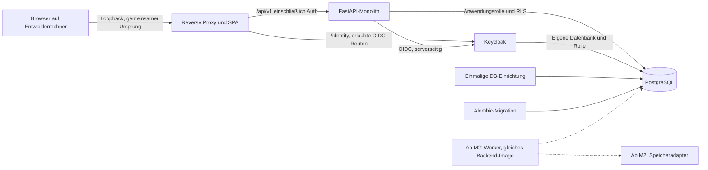

# Docker- und Betriebsarchitektur

> Fortschreibung 10.09.2026: Der folgende Phase-0-Entwurf bleibt das Zielbild. Den konkreten Phase-1-Stand beschreiben [ADR 0002](adr/0002-phase1-runtime-and-contracts.md), [API-Verträge](API_CONTRACTS.md) und [Prüfbericht](testing/PHASE_1_REPORT.md). Entwurfswerte sind keine Laufzeitnachweise.

Stand: **9. September 2026**. Status: **geplant, nicht implementiert und nicht im Container getestet**. Dieses Dokument beschreibt die zu erstellenden Dateien; es ist noch keine Startanleitung für vorhandene Container.

## Geprüfte Phase-1-Laufzeit

Am 10./11.09.2026 unter Docker Desktop auf Windows/AMD64 mit Linux-Containern gebaut und ausgeführt. Die echte Startanleitung steht im [README](../README.md). API und Proxy besitzen eigene Build-/Teststufen; PostgreSQL wird mit gepatchten Alpine-Bibliotheken und su-exec abgeleitet. Digestpins und konkrete Sicherheitskorrekturen: [ADR 0003](adr/0003-phase1-security-and-performance.md). Der geprüfte Wechsel der API auf Alpine und der vollständige Restore mit OIDC sind in [ADR 0004](adr/0004-api-base-and-complete-restore.md) dokumentiert.

Nur der Proxy veröffentlicht 127.0.0.1:8080. API/Proxy laufen ohne root mit schreibgeschütztem Root-Dateisystem und temporären Pfaden unter /tmp. Keycloak läuft als UID 1000, PostgreSQL senkt den Prozessbenutzer nach Initialisierung ab. Getrennte Rollen, Migration, Login, DB-Ausfall und Restore auf frischem Volume sind tatsächlich geprüft. Offene Basisimagebefunde und nicht geprüfte Plattformen stehen im [Prüfbericht](testing/PHASE_1_REPORT.md).

Die folgenden Abschnitte bewahren das breitere Phase-0-Zielbild.

## Ziel und Grenze des ersten Betriebsmodells

Phase 1 liefert einen lokalen, vollständig nutzbaren Entscheidungsworkflow. Nach einmaliger dokumentierter Konfiguration soll `docker compose up --build` die Standardumgebung starten. Lokale PostgreSQL-/Redis-Installationen, ein Cloud-Konto oder ein LLM-Schlüssel dürfen dafür nicht erforderlich sein.

Der modulare Monolith wird als ein Backend-Image gebaut. Entwicklung und Tests dürfen unterschiedliche Build-Stufen nutzen; fachlich bleibt es dieselbe Anwendung. Die produktionsähnliche Demo liefert die gebaute React-SPA über den Reverse Proxy aus. Node dient dort nur zum Bauen.

## Dienste und Privilegien

| Dienst | Phase | Aufgabe | Netz und Datenzugriff |
| --- | --- | --- | --- |
| `proxy` | P1 | SPA, API-Weiterleitung, Authentifizierungsrouten, Header, Größen-/Zeitlimits | Einziger regulärer Host-Port; verbindet Eingangsnetz mit API/IdP-Netz, kein DB-Zugriff. |
| `api` | P1 | Domänen, API, serverseitige Sitzung, deterministischer Manager und Verifier | Fachdaten über `platform_app` mit RLS; Auth-Bootstrap separat über begrenzten `platform_auth`-Pool; OIDC-Verbindung, kein Docker-Socket. |
| `postgres` | P1 | Anwendungsdaten, Audit, Sitzungen; getrennte IdP-Datenbank | Kein standardmäßig veröffentlichter Datenbankport; benanntes Volume. |
| `db-init` | P1 | Separate Datenbanken/Rollen für Anwendung, Migration und IdP anlegen | Einmaliger Verwaltungszugriff, begrenzter Prozess; Verwaltungsgeheimnis wird nicht in API/Worker übernommen. |
| `migrate` | P1 | Schema, Constraints, Indizes, Rechte und RLS auf Zielrevision bringen | Eigenes DDL-Konto `platform_migrator`; einmaliger Prozess, Fehler blockiert Anwendungsstart. |
| `keycloak` | P1 | OIDC-Anmeldung, lokaler Test-/Demo-Realm | Eigene Datenbank und eigener Benutzer, keine Rechte auf Anwendungstabellen. |
| `seed` | P1 Demo/Test | Explizite synthetische Organisationen, Benutzerzuordnung und Szenarien | Idempotent; nur im passenden Modus, niemals implizit in Produktion. |
| `frontend-dev` | P1 Entwicklung, optional | Vite-Hot-Reload | Nur über Proxy erreichbar; kein offener HMR-Port ins LAN. |
| `test-runner` | P1 Test | Backend-, API- und Browserprüfungen | Frische Testdatenbanken und kurzlebige Volumes; keine Produktionsgeheimnisse. |
| `worker` | Ab M2 | Datei-/Analyseaufträge, später Inventar und Evaluation | Dasselbe Backend-Image mit anderem Startkommando; begrenzte Rollen und konfigurierter Speicher-Port. |
| Lab-Runner und verwundbare Ziele | M5 | Ausschließlich autorisierte lokale Sicherheitstests | Eigene Compose-Datei, eigenes internes Netz und eigenes Compose-Projekt. |

Eine PostgreSQL-Instanz mit getrennten Datenbanken spart lokal Ressourcen. Das ist keine physische Isolation. Keycloak darf keine Anwendungsdaten lesen; die API darf das IdP-Schema nicht verändern. Eine produktive Zielumgebung kann beide Datenbanken getrennt betreiben.

Innerhalb der Anwendung hat `platform_auth` ausschließlich eng begrenzte Rechte für Sitzung, OIDC-Transaktion und Mitgliedschaftsprüfung. Diese Verbindung wird nicht für Fachabfragen verwendet. Weder `platform_auth` noch `platform_app` besitzt `BYPASSRLS`; ausschließlich die Migrationsrolle verwaltet DDL. Die getrennten Pools und Geheimnisse begrenzen Fehlverwendung, stellen aber innerhalb eines kompromittierten Monolithprozesses keine Prozessisolation dar.

## Umgebungen und geplante Dateien

| Umgebung | Geplante Zusammensetzung | Besondere Regeln |
| --- | --- | --- |
| `development` | `docker-compose.yml`, optional `docker-compose.override.yml` | Loopback, Quellcode-Mounts nur dort, Hot Reload optional. IdP-Entwicklungsmodus nur mit klarer Modusprüfung. |
| `test` | Separate `docker-compose.test.yml` | Eigener Projektname, frische DB, deterministischer KI-Provider, nichtinteraktiver Test-Exitcode. |
| `demo` | Basis plus `docker-compose.demo.yml` | Gebaute Images, synthetischer Seed, keine Quellcode-Mounts, kein externer KI-Aufruf als Standard. |
| `security-lab` | Ausschließlich `docker-compose.security-lab.yml` | Eigenständig; nicht von Basis oder Produktion inkludiert. Zielcontainer ohne veröffentlichte Ports. |
| `production-template` | Separate `docker-compose.production-template.yml` | Vorlage mit erforderlichen Betriebswerten, TLS, echten Geheimnissen, deaktivierten Demo-/Dev-Schaltern. Kein Anspruch auf fertige Produktivfreigabe. |

Dateien wie `.env.example`, `.dockerignore`, Backend-/Proxy-Dockerfiles und gegebenenfalls Dev-Dockerfile entstehen erst in Phase 1. Der Dateiname „security-lab“ allein ist keine Sicherheitskontrolle. Die Produktionsvorlage enthält keine Lab-Dienste, auch keine über ein aktivierbares Profil. Compose-Profile können beim expliziten Start eines Dienstes automatisch aktiviert werden; deshalb ist die Dateitrennung bewusst stärker als ein gemeinsames Profil. [Docker: Profile, geprüft 09.09.2026](https://docs.docker.com/compose/how-tos/profiles/)

## Netzwerk, OIDC und Browsergrenze

Standardmäßig wird nur der Proxy veröffentlicht, beispielsweise als `127.0.0.1:8080:8080`. Für IPv6 darf ein etwaiges zusätzliches Binding ausschließlich `::1` verwenden. Keine Kurzform, die unbeabsichtigt alle Host-Schnittstellen bindet. API, DB, Keycloak-Managementport und Vite erhalten keinen allgemeinen Host-Port. Docker dokumentiert die Unterschiede zwischen allgemeinen und Loopback-Bindings; die tatsächliche Erreichbarkeit gehört zusätzlich in den Umgebungstest. [Docker: Port-Veröffentlichung, geprüft 09.09.2026](https://docs.docker.com/engine/network/port-publishing/)

OIDC benötigt einen kanonischen Issuer, der im Browser sichtbar und vom Backend korrekt validiert werden kann. Ein Containername als Browser-Redirect oder unterschiedliche Issuerwerte werden nicht durch deaktivierte Prüfungen „repariert“. Phase 1 muss die konkrete Proxy-/Hostname-Konfiguration beweisen: Discovery, Redirect, Codeaustausch, JWKS, Logout und Neustart. Keycloak unterstützt Containerbetrieb; seine aktuelle DB-Matrix führt PostgreSQL 18 als getestet. Das beweist noch nicht die konkrete Proxy-Integration. [Keycloak: Container](https://www.keycloak.org/server/containers), [Datenbanken](https://www.keycloak.org/server/db), jeweils geprüft 09.09.2026.

Die SPA erhält nur ein undurchsichtiges Sitzungscookie. Zugriffstokens bleiben serverseitig. Die Produktionsvorlage verlangt HTTPS, `HttpOnly`, `Secure`, geeignete `SameSite`-Einstellung und CSRF-Prüfung bei Zustandsänderungen. Eine ausschließlich lokale HTTP-Entwicklungsvariante muss ausdrücklich als solche konfiguriert sein; die Anwendung muss eine solche Konfiguration in `production-template` ablehnen. Weitergeleitete Host-/Proto-Header werden nur vom eigenen Proxy akzeptiert. Keycloak-Administrations- und Managementrouten sind über die regulären Browserrouten gesperrt; lokale Administration benötigt eine bewusste gesonderte Entwicklungskonfiguration.

„Internes Netz“ ist keine vollständige Egress-Firewall. Für den Standardstack werden notwendige Verbindungen dokumentiert; externe KI bleibt deaktiviert, bis der Adapter ausdrücklich eingeschaltet ist. Im späteren Lab wird zusätzlich jeder auflösbare Zielendpunkt anhand des Scope-Manifests geprüft. Scanner-Container sind nicht gleichzeitig am allgemeinen Anwendungsnetz angeschlossen.

## Start, Migration und Bereitschaft

1. Konfiguration vor dem Start prüfen: Modus, erforderliche Geheimnisse, erwarteter Issuer, zulässiger Ursprung, keine Produktions-Demokonten.
2. PostgreSQL starten und Erreichbarkeit prüfen. `pg_isready` allein beweist weder erfolgreiche Migration noch korrekte Rollenrechte.
3. `db-init` muss erfolgreich enden. Ein existierendes Volume ist ein regulärer Fall: Rolleneinrichtung wird kontrolliert wiederholbar ausgeführt; Initialisierungsskripte für ein leeres Volume gelten nicht als Upgradeweg.
4. `migrate` führt genau eine geordnete Migration aus. Parallelstart wird mit Sperre verhindert. Ein nicht nuller Exitcode stoppt die Freigabe von API und Seed. Die API verändert ihr Schema nicht nebenbei beim Start.
5. Keycloak startet mit eigener Schemaführung; für Demo/Test wird der deklarierte Realm kontrolliert eingerichtet. Anwendungsmigrationen greifen niemals in Keycloak-Tabellen ein.
6. API-Bereitschaft prüft Konfiguration, DB-Verbindung und erwartete Schema-/Berechtigungsgrundlage. Proxy/Frontend zeigen während fehlender Bereitschaft einen verständlichen Zustand.
7. Optionaler Demo-Seed wird geprüft; bei Fehler wird die Demo nicht als einsatzbereit ausgewiesen.

Compose stellt unter anderem `service_healthy` und `service_completed_successfully` für Startabhängigkeiten bereit. Die Implementierung verwendet diese bewusst; sie ersetzen keine Fehlerbehandlung bei späteren Ausfällen. [Docker: Startreihenfolge, geprüft 09.09.2026](https://docs.docker.com/compose/how-tos/startup-order/)

`/api/v1/health/live` meldet, ob der Prozess antworten kann. `/api/v1/health/ready` meldet die Bereitschaft des deterministischen Kernsystems. Ein optional ausgefallener KI-Anbieter darf diese Bereitschaft nicht verhindern. Der IdP-Status wird gesondert sichtbar: neue Anmeldungen scheitern kontrolliert, während gültige, lokal prüfbare Sitzungen nur innerhalb ihrer vorgesehenen Frist weiterarbeiten dürfen. Öffentliche Health-Antworten enthalten keine Hostnamen, Geheimnisse oder Datenbankdetails.

Laufende Datenbankausfälle erzeugen begrenzte Timeouts und sichere Fehlermeldungen; keine Erfolgsmeldung ohne Commit. Neustarts erzwingen keine endlosen Migrationen. Spätere Worker besitzen Leases, Heartbeats, begrenzte Wiederholungen und idempotente Ergebnisübernahme. Nach SIGTERM nehmen sie keine neuen Aufträge an; laufende Arbeit wird abgeschlossen oder nach Ablauf der Lease nachvollziehbar wiederaufgenommen.

## Images, Dateien und Geheimnisse

Geplant sind mehrstufige Builds mit reproduzierbaren Lockfiles, Versions- und Digest-Pins, möglichst kleinem Laufzeitimage und nicht privilegiertem Benutzer. Buildwerkzeuge und Browser-Tests gehören in Build-/Teststufen. Container erhalten keine zusätzlichen Linux-Fähigkeiten; `no-new-privileges`, ein schreibgeschütztes Dateisystem und gezielt begrenzte Schreibverzeichnisse werden komponentenweise getestet. Ein pauschales `read_only` ohne Prüfung darf Keycloak oder Postgres nicht funktionsunfähig machen.

Geheimnisse liegen nicht im Image, Repository oder Build-Argument. `.env.example` enthält Platzhalter. Lokale Geheimnisdateien sind ignoriert und werden nur dem jeweiligen Dienst bereitgestellt; Compose-Secrets allein bedeuten keine verschlüsselte Speicherung auf dem Entwicklerrechner. Der Produktivbetrieb benötigt eine begründete Geheimnisverwaltung und Rotation.

Logs gehen strukturiert auf stdout/stderr und tragen Anfrage-, Mandanten-, Bewertungs- und Lauf-IDs, soweit dies ohne sensible Inhalte möglich ist. Proxylogs redigieren OIDC-Codes und andere vertrauliche Queryparameter. Es gibt keine Promptvolltexte oder Tokens in Standardlogs. Aufbewahrung und begrenzte Loggröße sind Betriebsparameter.

## Sicherung und Wiederherstellung

Benannte Volumes ermöglichen Persistenz bei Containerersatz; sie sind **keine Sicherung**. Phase 1 muss bereits den Wiederanlauf einer Demo einschließlich Organisation, Szenario und Bewertung nach Containerneustart sowie einen echten DB-Restore auf ein frisches Volume beweisen.

Die Betriebsanleitung beschreibt logische Sicherungen der Anwendungs- und IdP-Datenbank mit passendem PostgreSQL-Werkzeug, erforderliche Rollen-/Konfigurationswiederherstellung, Verschlüsselung, getrennten Speicherort, Aufbewahrung und Integritätsprüfung. Ein Keycloak-Realmexport ersetzt kein vollständiges DB-Backup. Sicherungen dürfen keine langlebigen Sitzungsschlüssel unkontrolliert vervielfältigen. Nach Restore werden Sitzungen und gegebenenfalls externe Tokens widerrufen oder neu ausgestellt.

Ab M2 gehören Objekte, Prüfsummen und Datenbankreferenzen zu einem konsistenten Sicherungssatz. Die Wiederherstellung wird in einer isolierten Zielumgebung geprüft: Schema, Rollen, RLS, Dateireferenzen, Datenanzahl und reproduzierbare Bewertung. Erst gemessene Backup-/Restore-Zeiten können eine Aussage über RPO/RTO der Plattform tragen. Fachlich eingetragene RTO-/RPO-Wünsche eines Demo-Unternehmens sind davon getrennt.

Produktive Daten werden nicht durch `down --volumes` oder vergleichbare Löschkommandos zurückgesetzt. Testbereinigung betrifft ausschließlich das zuvor überprüfte Testprojekt und dessen Volumes. Datenbankupgrades erhalten Sicherung, Wiederherstellungsplan und einen neuen Integrationsnachweis; ein neuer Major-Tag darf kein vorhandenes Datenvolume ungeprüft übernehmen.

## Security-Lab ab M5

Das Lab besitzt einen separaten Compose-Projektnamen, eigene Volumes und ein `internal`-Netz. Verwundbare Ziele haben keine Host-Portfreigabe. Ein menschlich gestarteter Lab-Runner erhält einen begrenzten Auftrag und Scanner-Konfiguration; die Plattform erhält keinen Host-Docker-Socket. Kein `privileged`, keine Host-PID-/Host-Netzwerkfreigabe und keine beliebigen Host-Mounts.

Für den ersten Lab-Ablauf werden Jobs und Belege über explizit exportierte/importierte, mandantengebundene Artefakte ausgetauscht. Das Lab erhält keine produktiven DB-/Cloud-/KI-Geheimnisse. Ein späterer vernetzter Runner benötigt einen eigenen ADR und einen authentifizierten, begrenzten Kanal. IP-/DNS-Änderung, Redirect und Ziel außerhalb des Scope-Manifests müssen vor dem Scan abgewiesen werden. Absichtlich angreifbare Images sind nur im Lab erlaubt und werden im Inventar klar als solche gekennzeichnet.

## Windows und CPU-Architekturen

Docker Desktop wird für Linux-Container mit einem unterstützten Windows-/WSL2-Setup verwendet. Die konkreten Hostvoraussetzungen sind vor Phase 1 anhand der aktuellen Herstelleranforderungen zu prüfen. [Docker Desktop für Windows, geprüft 09.09.2026](https://docs.docker.com/desktop/setup/install/windows-install/)

Der vorhandene Arbeitsordner enthält Leerzeichen und liegt in OneDrive. Projektpfade werden relativ konfiguriert; Geheimnisse, PostgreSQL-Daten und spätere große Uploads gehören in geeignete lokale Volumes, nicht in synchronisierte Repository-Unterordner. Zeilenenden, Linux-Dateirechte und Dateiüberwachung müssen im Windows-Durchlauf getestet werden. Die gleiche Anleitung benötigt eine PowerShell-taugliche Variante ohne vorausgesetztes Bash-Skript.

Zielplattformen sind `linux/amd64` und `linux/arm64`. Hersteller-Manifeste, mehrplattformfähige Builds, emulierte Starttests und native Tests sind getrennte Nachweise. QEMU-Bau allein beweist keine native Performance oder vollständige Kompatibilität. [Docker: Multi-Plattform-Builds, geprüft 09.09.2026](https://docs.docker.com/build/building/multi-platform/)

Lokal wurden Docker-CLI **29.5.2** und Compose **5.1.4** gefunden, mit einer Zugriffswarnung beim Lesen von `C:/Users/qt_/.docker/config.json`. **Daemon-Erreichbarkeit, Image-Bau, Start, OIDC und beide CPU-Architekturen sind nicht geprüft.** Das wird in Phase 1 vor einem Laufzeitversprechen geklärt.

## Abnahmeevidenz für Phase 1

Erforderlich sind Compose-Konfigurationsprüfung, dokumentierter frischer Start, fehlschlagende Migration als Negativfall, funktionierende OIDC-Anmeldung hinter dem Proxy, erreichbare SPA/API, nachgewiesene Loopback-Grenze, Persistenz nach Neustart, Restore auf frischem Volume, Image-/Abhängigkeitsscans und der vollständige fachliche Browserworkflow. Nicht durchgeführte Plattformtests werden als „nicht getestet“ geführt und nicht als bestandene Gates gezählt. Siehe [Teststrategie](testing/TEST_STRATEGY.md) und [Abnahmekriterien](testing/MILESTONE_ACCEPTANCE.md).

## Tatsächlich ergänzter Datenworker

Der Compose-Dienst data-worker führt platform_app.data.worker aus demselben API-Image aus. Er hat 256 MiB, eine CPU, schreibgeschütztes Root-Dateisystem, UID 10001, keine Capabilities, keine Ports und nur das interne Datennetz. Er erhält ausschließlich die Anwendungs-DB-Verbindung; Auth-/Migrationszugänge und OIDC-/OpenAI-Geheimnisse werden nicht übergeben.

DATA_WORKER_ORGANIZATION_IDS enthält die explizit zu bearbeitenden UUIDs. Der Demo-Default nennt ausschließlich die zwei synthetischen Mandanten. Große Datenmengen oder weitere Organisationen werden nicht automatisch freigeschaltet.

Die Restore-Übung pausiert den Originalworker während der Sicherung und nimmt ihn auch bei Fehlern wieder auf. Der getrennte Restore-Stack startet seinen eigenen Worker ohne Migration/Seeding und prüft den Datenworkflow über echten OIDC-Login.

Seit der 1-GiB-Erweiterung besitzt der Worker das benannte Arbeitsvolume data-work unter /work. DATA_WORK_DIRECTORY und SQLITE_TMPDIR verweisen dorthin; auch SQLite-Sortierungen liegen auf Datenträger und nicht im /tmp-tmpfs. Das Root-Dateisystem bleibt schreibgeschützt. Veröffentlichte Originale/Versionen/Exporte liegen vollständig in PostgreSQL, das Arbeitsvolume enthält temporäre Kopien. Mindestens 6 × Quelldateigröße + 256 MiB freier Arbeitsplatz wird vor Verarbeitung verlangt. Die lokale API-Rate ist auf 1.000 Anfragen pro Minute eingestellt, damit ein 256-Abschnitt-Upload die alte Rate nicht überschreitet.
