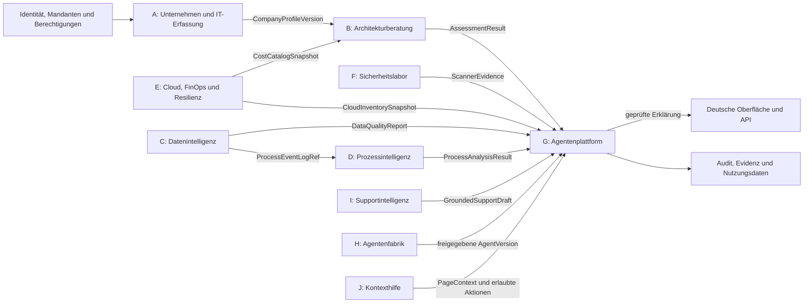

# Domänenkarte und Modulverträge

Stand: 09.09.2026 · Phase 0 · **Architekturentwurf; keine Funktion ist damit implementiert.**

Die Plattform verbindet überprüfbare fachliche Berechnungen mit begrenzter Agentenunterstützung. Der erste durchgängige Ablauf umfasst Unternehmenserfassung, Architekturvergleich, Kostenvergleich, regelbasierte Erklärung und unabhängige Prüfung. Alle späteren Module bleiben ausdrücklich geplant, bis ihr eigener Ablauf mit Persistenz, Berechtigungen, Oberfläche und Tests funktioniert.

## 1. Begriffe und fachliche Grenzen

Eine `Organization` ist ein Mandant mit Mitgliedschaften und Zugriffsrechten. Ein `CompanyProfile` ist ein benanntes Unternehmensszenario innerhalb dieses Mandanten, beispielsweise „Ist-Zustand“ oder „Wachstum“. Ein Szenario besitzt unveränderliche Versionen. Ein `Workload` beschreibt einen fachlichen Anwendungsfall innerhalb genau einer Profilversion. Ein `Assessment` bewertet eine unveränderliche Eingabefassung mit festgehaltenen Regel-, Bewertungs- und Kostenkatalogversionen.

SaaS, PaaS und IaaS bezeichnen Service-Modelle; Public und Private Cloud bezeichnen Bereitstellungsmodelle. On-Premises beschreibt einen Betriebsort. Hybrid beschreibt im Produkt einen verbundenen Gesamtplan mit mehreren Betriebsformen. Diese Begriffe werden nicht als gleichartige Auswahlalternativen in eine einzige Liste gepackt. Die Trennung von Service- und Bereitstellungsmodellen entspricht dem [NIST-Begriffsmodell](https://csrc.nist.gov/pubs/sp/800/145/final); Betriebsort und klassischer Eigenbetrieb sind zusätzliche Produktachsen.

| Achse | Werte im ersten Entscheidungsmodell | Bedeutung |
|---|---|---|
| `service_model` | `SAAS`, `PAAS`, `IAAS`, `SELF_MANAGED` | Verantwortungsumfang; `SELF_MANAGED` bezeichnet klassischen Eigenbetrieb ohne behauptetes Cloud-Service-Modell |
| `deployment_model` | `PUBLIC_CLOUD`, `PRIVATE_CLOUD`, `TRADITIONAL` | Bereitstellung und Exklusivität der Umgebung |
| `hosting_location` | `PROVIDER`, `ON_PREMISES`, `COLOCATION` | Ort und Verantwortungsgrenze des Betriebs |
| Planbeschreibung | homogen oder integriert gemischt/hybrid | Aus den Workload-Zuordnungen und dokumentierten Verbindungen abgeleitet; keine vierte konkurrierende Service-Kategorie |

Die Matrix zulässiger Kombinationen ist versioniert. Ein eigener physischer Server wird nicht allein wegen seines Standorts als Private Cloud eingestuft. Ein öffentlich betriebener SaaS-Dienst ist nur dann Kandidat, wenn seine nachgewiesenen fachlichen Funktionen den betreffenden Workload abdecken. Nicht unterstützte Kombinationen werden ausgeschlossen; fehlende Informationen ergeben „nicht beurteilbar“, keinen erfundenen Fit.

## 2. Modulgrenzen und Abhängigkeiten

Das Diagramm zeigt fachliche Vertragsrichtungen, keine gegenseitigen ORM-Importe. Der Anwendungsdienst orchestriert A → B → G. B kann ohne Agentenplattform berechnen. Die Kostenberechnung in B konsumiert einen Port; der kleine versionierte Katalog ist in Phase 1 Bestandteil dieses Schnitts. Das vollständige Cloud-Modul E wird dafür noch nicht gebaut. G konsumiert Ergebnisse über DTOs und importiert keine Datenbanktabellen von B.

## 3. A — Unternehmen und IT-Erfassung

**Zweck:** Aus dokumentierten Unternehmensanforderungen werden überprüfbare Eingaben für spätere Entscheidungen.

**Eigentum:** `CompanyProfile`, `CompanyProfileVersion`, `Workload`, `InfrastructureAsset`; später eigenständige Standort- und Anwendungsverzeichnisse, wenn diese mehrere Szenarien gemeinsam nutzen müssen. Eine gespeicherte Version enthält ihre eigenen Angaben; spätere Inventaränderungen überschreiben sie nicht.

**Vollständiger Zielumfang:** Branche, Größe, Mitarbeitende, IT-Personal, Standorte, Anwendungen, Infrastruktur, Netzstruktur, Workloads, Datenbanken, Speicher, Datenvolumen, Datenverkehr, Wachstum, Latenz, Verfügbarkeit, RTO/RPO, Sensitivität, regulatorische Anforderungen, Budget, CAPEX/OPEX-Präferenz, Anbieter, Cloud-Erfahrung, Kompetenzen, Altsysteme, Fernarbeit, Geschäftsziele und Kosten-/Leistungspräferenzen. Angaben sind entweder konkrete Werte mit Einheiten, begrenzte Kategorien oder versionierte strukturierte Unterobjekte; Freitext ist keine ausführbare Regel.

**Phase 1:** Mehrere Szenarien anlegen, speichern, neu versionieren und vergleichen; alle für die erste Bewertungsmatrix benötigten Angaben validieren. Nicht benötigte Zusatzangaben dürfen fehlen und erzeugen keinen stillen Standardwert. Herkunft „Nutzereingabe“, „Demo“ oder „Annahme“ bleibt erhalten. Der Demo-Datensatz enthält keine realen Unternehmens- oder Personendaten.

**Verträge:** `CreateCompanyProfile`, `SaveCompanyProfileVersion(expected_revision, intake)`, `CompanyProfileVersionDTO`, `WorkloadRequirementsDTO`. Schreibrechte benötigt `company_profile:write`; Lesen und Bewerten sind getrennte Berechtigungen. Zur Bewertung wird eine explizite Profilversion übergeben, niemals „die gerade neueste“ ohne festgehaltene ID.

## 4. B — IT-Architekturberatung

**Zweck:** Für jeden Workload geeignete Architekturen berechnen und daraus nachvollziehbare Gesamtpläne mit Alternativen bilden.

**Eigentum:** `AssessmentSnapshot`, `ArchitectureCandidate`, `CandidateWorkload`, `ConstraintResult`, `CriterionResult`, `CostEstimate`, `CostEstimateLine`. Die Domäne verantwortet die fachlichen Ergebnisse; Agententexte haben keine Schreibberechtigung darauf.

**Bewertungsablauf:**

1. Eingabe, Einheiten, Vollständigkeit und Versionen prüfen; unzureichende Eingabe ausdrücklich benennen.
2. Kandidaten aus zulässigen Service-/Bereitstellungs-/Betriebsortkombinationen erzeugen. SaaS-Funktionsabdeckung und benötigte Hardware/Netzkomponenten explizit prüfen.
3. Harte Bedingungen vor Scores prüfen: beispielsweise vorgeschriebene Datenresidenz, tatsächlicher Funktionsumfang, Budgetobergrenze, belegte Latenzgrenze, RTO/RPO und notwendige Personalverfügbarkeit. Eine Bedingung besitzt `PASS`, `FAIL` oder `UNKNOWN`. Ein `FAIL` schließt aus; ein `UNKNOWN` bei einer zwingenden Bedingung verhindert eine belastbare Empfehlung.
4. Für zulässige Kandidaten nachvollziehbare Kriterienwerte berechnen. Dimensionen sind Kosten, Leistung, Verfügbarkeit, Betriebskomplexität, Personal, Sicherheit, Anbieterbindung, Skalierung, Sensitivität, Latenz, Wartung, Sicherung/Wiederanlauf und Einführungszeit. Unbekannte Werte bleiben unbekannt. Scores geben Zielerfüllung unter Modellannahmen wieder; „Sicherheit 90“ ist keine gemessene Sicherheitsgarantie.
5. Gewichte für Sparmodus, Leistungsmodus oder benutzerdefinierte Profile validieren. Gewichtssumme muss positiv sein; nur vollständig bewertbare Kriterien dürfen ohne Kennzeichnung aggregiert werden. Fehlende gewichtete Kriterien ergeben einen vorläufigen Kandidaten ohne endgültigen Rang. Gleichstände erhalten denselben Rang; eine stabile Kandidatenkennung sorgt nur für reproduzierbare Darstellung.
6. Kostenzeilen, Vor-/Nachteile, Ausschlussgründe, Risiken, Annahmen, Evidenz und notwendige nächste Messung zurückgeben. Ein leerer zulässiger Lösungsraum ist ein gültiges Ergebnis.

**Phase 1:** Deterministische Regeln, ein begrenzter dokumentierter Kandidatenkatalog und nachvollziehbare TCO-/CAPEX-/OPEX-Rechnung. P1 begrenzt die Suche auf höchstens zehn Workloads und zwanzig vollständige Architekturpläne je Assessment; die Grenzen sind Produktannahmen, die Lasttests überprüfen müssen. Alle Pläne enthalten eine Zuordnung für jeden Workload. Keine Behauptung einer global optimalen Lösung außerhalb des durchsuchten Katalogs.

**Kostenregeln:** Beträge mit Dezimalarithmetik, expliziter Währung und Zeithorizont. Einmalige Anschaffung/Migration plus periodische Betriebs-, Personal-, Netz-, Speicher-, Sicherungs- und gegebenenfalls Lizenzpositionen ergeben den ausgewiesenen Modell-TCO. Nicht enthaltene Kosten und Steuerbehandlung werden benannt. Der P1-Katalog ist **synthetisches Demo-Rechenmaterial; keine Marktpreisauskunft**. Fehlende Positionen ergeben unvollständige Kosten statt `0`. Kein Live-Preisabruf, kein Währungshandel und keine implizite Rabattannahme.

**Verträge:** `AssessmentRequest(profile_version_id, weighting, horizon_months, catalog_version_id)`, `AssessmentResult`, `CandidateEvaluation`, `CostBreakdown`, `EvidenceRef`. Die Antwort enthält nicht nur den Sieger, sondern auch Ausschlussgründe und die gewichtete Matrix. Ein Qualitätsindikator heißt `evidence_coverage`; er ist keine statistisch kalibrierte Erfolgswahrscheinlichkeit.

## 5. C — Datenintelligenz

**Status:** Nach Phase 1 geplant. **Eigentum:** `Dataset`, `DatasetVersion`, `DataProfile`, `TransformationPlan`, `TransformationRun`, `Analysis`, `DataQualityRule`.

CSV, JSON, XLSX, Parquet und freigegebene Datenbankquellen werden über kontrollierte Adapter importiert. Profiling umfasst Schema, Typen, Nullwerte, Duplikate, ungültige Werte, Verteilungen, Ausreißer, Statistiken, Zusammenhänge und geeignete Zeitreihenmerkmale. ML wird nur ergänzt, wenn klassische Statistik das konkrete Problem nicht ausreichend löst.

Manuelle Bereinigung und KI-gestützte Vorschläge erzeugen denselben typisierten, reproduzierbaren Plan. Vorschau ist getrennt von Anwendung; Rohdaten bleiben unverändert. Jede abgeleitete Version referenziert Ursprung, Transformationsversion, ausführende Person, Parameter und Prüfbericht. Inhalte großer Dateien gehören später in einen `ObjectStoragePort`, Metadaten und Lineage nach PostgreSQL. Es wird in Phase 1 weder MinIO noch ein leerer Uploaddienst benötigt.

**Verträge:** `DatasetVersionRef`, `DataQualityReport`, `TransformationPlanDTO`, `TransformationPreview`, `ProcessEventLogRef`; keine Übergabe von Tabellen als unkontrollierter Prompt an D oder G.

## 6. D — Prozessintelligenz und Optimierung

**Status:** Nach C geplant. **Eigentum:** `ProcessDefinition`, `ProcessEventMapping`, `ProcessAnalysis`, `ProcessRecommendation`.

Ein freigegebenes Mapping legt mindestens Fallkennung, Aktivität, Zeitstempel und deren Zeitzone fest. Datenqualitätswarnungen, Start-/Endereignisse, unvollständige Fälle und Stichprobengrenzen begleiten jede Kennzahl. Berechnet werden, soweit die Daten es erlauben, Durchlauf-/Wartezeit, Durchsatz, Engpässe, Ressourcenauslastung, Nacharbeit, Fehlerpunkte, Warteschlangen und Varianz.

Vorschläge verbinden Ist-Prozess, messbaren Engpass, Änderung, erwarteten Nutzen, Risiko, Kosten und den nachgelagerten Wirksamkeitstest. Erwartete Verbesserungen sind Hypothesen, bis eine Messung vorliegt. Eine Process-Mining-Bibliothek wird erst nach Beispieldaten, Nutzenvergleich und Lizenzprüfung ausgewählt.

**Verträge:** `AnalyzeProcess(ProcessEventLogRef, ProcessMapping)`, `ProcessAnalysisResult`, `ProcessComparison`. D liest eine veröffentlichte Dataset-Version über C, nicht dessen Speichertabellen.

## 7. E — Cloud-Architektur, FinOps und Resilienz

**Status:** P1 nutzt ausschließlich den Kostenkatalog-Port; Cloudverbindungen und das übrige Modul sind später geplant. **Eigentum:** später `CloudConnection`, `CloudInventorySnapshot`, `CloudResource`, `FinOpsRecommendation`, `ResiliencePlan`, `InfrastructureChangePlan`; fachlich auch die Weiterentwicklung des Kostenkatalogs.

Azure-/AWS-Adapter liefern zunächst nur lesbare Bestands- und Kostendaten. Rechte, Datumsstand, Quelle, Region, Einheit und Genauigkeit sind Bestandteil des Vertrages. Rechtebegrenzte Verbindungen und externe Zugangsdaten werden außerhalb normaler Fachobjekte verwaltet; kein Cloud-Schlüssel im Profil oder Agentenprompt.

Bewertet werden Architektur, Tagging, Ressourcenbedarf, Rightsizing, Sicherungen, Disaster Recovery, RTO/RPO, Zonen/Regionen, Speicher-Lifecycle, Netzarchitektur und IAM/RBAC. Mengen, interne Verrechnungssätze und reale Anbieterpreise bleiben unterscheidbar. Empfehlungen verbinden Kosten mit dem fachlichen Bedarf und möglichen Verfügbarkeitsfolgen.

**Verträge:** `CloudInventorySnapshot`, `CostCatalogSnapshot`, `ResilienceAssessment`, `InfrastructurePlan`. Infrastrukturänderungen besitzen getrennte Zustände `PLAN`, `REVIEW`, `APPROVE`, `APPLY`; Freigabe bindet sich an exakten Plan-Hash, Ziel und Ablaufzeit. Terraform-Vorschläge sind in sich noch keine Ausführungserlaubnis.

## 8. F — defensives Sicherheitslabor

**Status:** Späterer eigener vertikaler Schnitt. **Eigentum:** `SecurityTarget`, `ScopeManifest`, `SecurityScan`, `ScannerEvidence`, `SecurityFinding`, `Remediation`.

Scans sind nur für explizit freigegebene eigene Repositories, Entwicklungsumgebungen und isolierte lokale Labore erlaubt. Scope-Manifest, Ziel-Allowlist, Netzbegrenzung, Laufzeit-, Ressourcen- und Ausgabebegrenzungen werden vor dem Scanner geprüft. Scanner-Adapter akzeptieren typisierte Optionen, keine frei generierten Shellbefehle.

Der erste Ablauf wählt einen begrenzten Scanner und deckt Freigabe, sichere Ausführung, echte Evidenz, Normalisierung, menschliche Bestätigung, Behebung und erneute Prüfung ab. Spätere Adapter können SAST, Abhängigkeits-/Containerprüfung, Secret Detection, SBOM, Konfigurationsanalyse, Header-/TLS-Prüfung und freigegebene passive/baseline DAST ergänzen. Keine willkürlichen Internetziele, ausnutzenden Angriffe oder öffentlich exponierten verwundbaren Labore.

**Finding-Vertrag:** ID, Asset, Schweregrad, optional belegter CVSS samt Version, CWE/OWASP-Zuordnung, Evidenz, Sicherheit der Einordnung, Fehlalarmstatus, Behebung, Verifikation, Status und Verantwortliche. Scannerbefund und Agenteninterpretation bleiben getrennte Datensätze. Ein Modell kann keinen Scannerlauf als erfolgreich markieren.

## 9. G — beaufsichtigte Agentenplattform

**Zweck:** Nachvollziehbare Koordination und begrenzte Erklärung vorhandener Ergebnisse. **Eigentum:** `AgentRun`, `VerificationResult`, `Explanation`; später `AgentDefinition`, `AgentVersion`, `ToolInvocation`, `ApprovalRequest`, Auswertungs- und Budgetdaten.

**Phase 1:** Ein deterministischer Manager koordiniert. Die Decision Engine und der Cost Estimator berechnen. Ein separater deterministischer Verifier prüft Schema, Evidenzreferenzen, Gewichtung, zulässige Kandidaten, Rangfolge und Summen mit eigenständigen Invarianten. Das ist keine Behauptung einer unabhängigen zweiten Wirtschaftsstudie. Die Standarderklärung entsteht aus festen Regeln/Vorlagen ohne Netzwerk oder Schlüssel.

Ein optionaler LLM-Erklärungsspezialist erhält ausschließlich einen minimierten, validierten `AssessmentExplanationInput`. Er besitzt keine Tools, keine Datenbankverbindung, kein eigenes Retrieval und keinen Zugriff auf ungefilterte Profile. Er darf ergänzende Erklärungen vorschlagen, jedoch weder Kosten noch Kriterien, Rang oder harte Bedingungen ändern. Sein Zustand ist vom Assessment getrennt; Ausfall, Timeout oder unzulässige Ausgabe lassen den geprüften Kernbericht verfügbar.

**Späteres Ziel:** Plattform-Supervisor → Domänenmanager → eng berechtigte Spezialisten, ergänzt durch unabhängige Verifier, Risk Reviewer, Cost Estimator und Policy-/Approval Gate. Keine vollvernetzte Agentengruppe. Jede Agentenversion definiert Verantwortung, verbotene Aktionen, Ein-/Ausgabeschema, Tool-Allowlist, Zeit-/Token-/Kosten-/Toolaufrufgrenzen, Wiederholung und Eskalation.

**Verträge:** `AgentTask`, `AgentRunSummary`, `EvidenceRef`, `VerificationResult`, `ExplanationResult`, später `ToolCallRequest` und `ApprovalDecision`. Ausgaben unterscheiden Tatsachen, Evidenz, Rechnungen, Annahmen, Ableitungen, Empfehlungen, Unsicherheit und notwendige Menschenentscheidungen. Gespeichert werden Betriebsdaten und knappe Entscheidungszusammenfassungen, keine verborgenen Gedankengänge.

## 10. H — kontrollierte Agentenfabrik

**Status:** Nach belastbarem G und Evaluationen geplant. **Eigentum:** `AgentProposal`, `AgentVersion`, `EvaluationSuite`, `EvaluationRun`, `AgentEnablementApproval`.

Vorschläge enthalten Spezifikation, Verantwortung, benötigte Tools/Rechte, Schemas, Grenzen, Risiken, Test-/Evaluationsfälle und versionierte Konfiguration. Lebenszyklus: `DRAFT → VALIDATION → EVALUATION → HUMAN_APPROVAL → ENABLED`; Fehler und Ablehnung bleiben nachvollziehbar. Aktivierung referenziert genau die geprüfte Versionskennung. Neue oder erweiterte Rechte invalidieren eine vorherige Freigabe.

G verwaltet Ausführungen, H verwaltet den Lebenszyklus und die Freigabe von Definitionen. Sobald H eingeführt wird, liegt das Schreibrecht an `AgentVersion` ausschließlich dort; G konsumiert veröffentlichte Versionen. Es gibt keine automatische Berechtigungsvergabe und keine Selbständerung laufender Produktionsagenten.

## 11. I — Supportintelligenz

**Status:** Nach tenant- und dokumentgebundenem Retrieval geplant. **Eigentum:** `KnowledgeDocument`, `KnowledgeVersion`, `KnowledgeAccessRule`, `SupportConversation`, `SupportTicket`, `SupportFeedback`.

Wissenssuche prüft Mandant und Dokumentberechtigung vor Abruf und vor Verwendung. Freigegebene Quelle, Versionsstand, Textstelle und Zugriffsentscheidung begleiten jeden Treffer. Gefundener Text bleibt untrusted Inhalt; darin enthaltene Befehle erhalten keine Systempriorität.

FAQ, Suche, Ticketklassifikation, Antwortentwürfe, Eskalation, Auswertung und Feedback verwenden belegbare Quellen. Unbekannte Unternehmensregeln werden nicht erfunden. Vertrauliche Informationen werden minimiert. Externe Antworten bleiben Entwürfe, bis eine dafür zuständige Person die konkrete Nachricht und Empfänger freigibt.

**Verträge:** `AuthorizedKnowledgeQuery`, `AuthorizedKnowledgeHit`, `SupportDraft`, `HumanEscalationRequest`. Vektorsuche ist eine spätere, zu evaluierende Retrievalstrategie; `pgvector` ist keine P1-Abhängigkeit.

## 12. J — Kontexthilfe innerhalb der Anwendung

**Status:** Statische fachliche Hilfe kann mit dem ersten UI-Schnitt entstehen; eine universelle KI-Hilfe ist später geplant. **Eigentum:** freigegebene `HelpArticle`-Versionen und später minimierte Hilfesitzungen/Feedback; keine eigenen Kopien sämtlicher Fachdaten.

`PageContext` enthält Modul, Seitenkennung, vom Server bestätigte Rolle, erlaubte Aktionen, einen minimierten sichtbaren Zustand und passende Dokumentationsreferenzen. Die Hilfe erklärt Zweck, Begriffe, aktuellen Zustand, sichere nächste Schritte, manuelle Bedienung und gegebenenfalls KI-Unterstützung. Browser-DOM, versteckte Felder oder ungeprüfte Benutzerangaben bilden keine Berechtigung.

J darf keine Berechtigung erweitern oder eine fachliche Freigabe ersetzen. Verlinkte Aktionen durchlaufen dieselben API-Prüfungen wie manuell ausgelöste Aktionen.

## 13. Gemeinsame Infrastruktur und Vertragsdisziplin

| Querschnitt | Verantwortung | Grenze |
|---|---|---|
| Identität/Zugriff | OIDC, serverseitige Sessions, Mitgliedschaft, Rollen, Berechtigungen, Mandantenkontext | Fachmodule erhalten bestätigten `ActorContext`, keine rohen Tokens |
| Audit | Append-orientierte Ereignisse, Trace-/Objektreferenzen, minimierte Akteursdaten | Kein Ersatz für Fachtabellen und kein Sammelspeicher vollständiger Prompts |
| Evidenz | Unveränderliche, typisierte Belege je Assessment/Analyse | Quelleninhalt ist Datenmaterial, keine Autorität für Agentenrechte |
| Jobs | Später PostgreSQL-gestützte Warteschlange mit Leasing, Abbruch, Retry und Idempotenz | Für P1 begrenzte deterministische Berechnung synchron; keine lange KI-/Scannerarbeit im Request |
| Speicherung | PostgreSQL; später `ObjectStoragePort` für große Artefakte | Kein generisches JSON-Dokument als Ersatz für das relationale Fachmodell |
| Beobachtbarkeit | Request-, Assessment-, Job- und Agent-IDs, Metriken, sichere Fehler | Keine Secrets oder ungefilterten Fachinhalte in normalen Logs |

Verträge sind versionierte Pydantic-DTOs; Frontendtypen werden aus OpenAPI erzeugt. Das Domänenmodell bleibt frei von HTTP- und ORM-Typen. Referenzen auf andere Module tragen Mandanten- und Versionskennung. Ein Modul schreibt ausschließlich eigene Tabellen. Modulübergreifende Orchestrierung verwendet öffentliche Anwendungsdienste und explizite Transaktionen; sie umgeht weder Berechtigungen noch RLS.

## 14. Bewusste Begrenzungen und Prüfaufträge

- „Umfassende Plattform“ ist das Zielbild. Phase 1 implementiert A, den ersten vollständigen B-Schnitt sowie die für ihn nötigen Teile von G und der Plattformbasis. Die übrigen Module erhalten keine funktionslosen Router oder Tabellen.
- P1-Kostenkatalog und Kompetenz-/Leistungsannahmen sind versionierte Demo-Modelle. Reale Entscheidungen erfordern später belegte Angebote, gemessene Anforderungen und verantwortliche Prüfung.
- Profile vergleichen Modellannahmen; die Plattform beweist keine regulatorische Konformität, SLA-Erfüllung oder tatsächliche Leistungsfähigkeit eines Anbieters.
- Rollen bleiben in Phase 1 eine kleine versionierte Codepolicy. Individuell editierbare Rollen, externe Cloudadapter, Dateiupload, universelles Retrieval und dynamische Agentenaktivierung werden erst mit eigenen Abnahmekriterien eingeführt.
- Phase 1 muss insbesondere zeigen: hart ausgeschlossener Kandidat gewinnt niemals durch hohe Scores; fehlende Daten werden sichtbar; alter Bericht bleibt nach Profil-/Katalogänderung reproduzierbar; LLM-Ausfall verändert das Ergebnis nicht; Mandant B kann keinerlei Daten von A lesen, schreiben oder referenzieren.

Das konkrete Persistenzmodell steht in [DATA_MODEL.md](../DATA_MODEL.md). Agentenrollen, Sicherheit, Betrieb und Tests werden in den jeweiligen Phase-0-Dokumenten vertieft.
