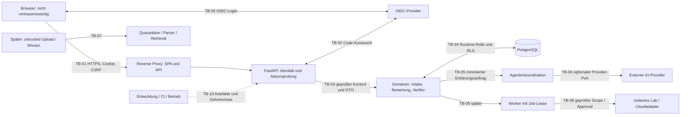

# Vertrauensgrenzen und Autorisierung

Status: **ENTWURF – NICHT IMPLEMENTIERT**. Stand: 09.09.2026. Grenz-IDs referenzieren das [Bedrohungsmodell](THREAT_MODEL.md). Rollen, Sessionmodell und Limits sind zur Implementierung vorgesehen; noch kein Nachweis sicherer Durchsetzung.

## Datenfluss

TB-03 und TB-05 sind Modul-/Berechtigungsgrenzen innerhalb eines Prozesses. Sie sind keine Betriebssystem-Sandbox. Der Provider ist ein eigenständiger Verarbeitungskontext, auch wenn sein SDK im API-Prozess läuft. Phase 1 verwendet weder Upload-/Retrievalpfad noch Worker/Labpfad.

## Grenzregister

| ID | Übergang und erlaubte Daten | Entscheidung am Eintritt | Sperrverhalten |
| --- | --- | --- | --- |
| TB-01 | Browser → Proxy/API: Cookie, CSRF, versionierte DTOs | TLS-/Hostkonfiguration, Bodylimit, Session, Origin/CSRF, Aktionsrecht | 401 ohne gültige Sitzung; 403 bei verbotenem Aktionstyp; 404 bei fremdem/nicht sichtbarem Objekt; begrenzte 429/413/422 |
| TB-02 | Browser/API ↔ OIDC: Code Flow, minimale Identitätsclaims | Konfigurierter Issuer, Signatur/Algorithmus, Audience, State/Nonce/PKCE, exakter Callback | Kein stiller Gast-/Administratorfallback; Loginfehler ohne Token/Secret im Log |
| TB-03 | API → Domäne: `ActorContext`, `TenantContext`, DTO | Serverseitig bestätigte Mitgliedschaft und Aktion; Objekt gehört zum Tenant | Domainservice verweigert fehlenden Kontext; Requestbody darf ihn nicht setzen |
| TB-04 | Domäne → DB: parametrisierte Statements | Runtime-Rolle, Transaktion, Tenantkontext, RLS und Constraints | Kein Mandant ergibt keine Fachzeilen/abgewiesenen Schreibzugriff; Fehler beendet Transaktion |
| TB-05 | Koordination → Spezialist/Verifier: versionierter Arbeitsauftrag | Feste registrierte Fähigkeit; enger Input-/Outputvertrag und Budget | Unbekannte Fähigkeit/Tool/Schema ablehnen; keine durch Text erweiterten Rechte |
| TB-06 | Provider-Port ↔ externer KI-Dienst: freigegebener Ausschnitt | Globale Konfiguration und Tenant-Policy, Datenklasse, Feld-Allowlist, Budget | KI aus bedeutet kein KI-/Trace-Egress; unerlaubter Kontext bricht nur Erklärung ab |
| TB-07 | Später Dokument/Datei/Quelle → Analyse/Wissen | Quarantäne, Typ-/Größenprüfung, Owner/Tenant/ACL, Quellenversion | Datei bleibt isoliert; externe Inhalte sind Daten ohne Instruktionsautorität |
| TB-08 | Später Adapter → Lab/Cloud/Kommunikationsziel | Aktionsrecht, Scope-Manifest, Netz-/Zielprüfung und ggf. gültiges Approval | Kein beliebiges Ziel, keine freie Shell, keine implizite Ausführung bei Unsicherheit |
| TB-09 | Später API/DB → Worker | Servererzeugter Job, Lease, Tenant/Actor/Policy erneut prüfen | Abgelaufene Rechte/Lease stoppen Ausführung; Retry nur idempotent |
| TB-10 | Quellcode/CI/Betrieb → Anwendung | Review, Build-/Lockfile-/Imageprüfung, Secretübergabe, Konfigurationsvalidierung | Unsichere Produktionskonfiguration verhindert Start; keine Test-Identität im Produktionsprofil |

## Identität und Sitzung in Phase 1

Der lokale OIDC-Provider übernimmt Passwörter und Anmeldeverfahren. Die Plattform implementiert keinen eigenen Passwortlogin. Eine gepflegte OIDC-Clientbibliothek erledigt den Protokollfluss. Der Browser erhält ausschließlich eine zufällige opake Plattformsitzung; OIDC-Tokens bleiben serverseitig und werden verworfen, sobald sie für diesen Login nicht mehr benötigt werden. Ein späterer Bedarf für Refresh-/Access-Tokens erfordert gesonderte Verschlüsselungs-/Widerrufsregeln.

Identität ist `(issuer, subject)`. E-Mail und Anzeigename sind Profilinformationen, keine Berechtigungsschlüssel. Eine erfolgreiche OIDC-Anmeldung erzeugt keine Mitgliedschaft und keine Administratorrolle. In der synthetischen Demo werden explizite Testmitgliedschaften reproduzierbar angelegt; öffentliche Registrierung und automatische Organisationserstellung bleiben außerhalb Phase 1.

Geplante Sitzung: mindestens 256 Bit kryptographischer Zufall, in PostgreSQL nur SHA-256 des Tokens, User-ID, Erzeugung, letzte Aktivität, absolute Gültigkeit und Widerruf. Idlelimit zunächst 30 Minuten, Absolutlimit 8 Stunden als konfigurierbare Produktentscheidung. Rotation nach Login und privilegierter Kontowechselaktion; Logout widerruft den serverseitigen Datensatz. Rechte werden bei jeder Aktion erneut aus der Mitgliedschaft ermittelt; der aktive Tenant kommt aus einer autorisierten Auswahl, niemals ungeprüft aus einem Header oder DTO.

HTTPS-Profile verwenden ein `__Host-`-Cookie mit `Secure`, `HttpOnly`, `Path=/`, ohne `Domain`, `SameSite=Lax`. Schreiboperationen benötigen zusätzlich einen sitzungsgebundenen CSRF-Token und eine erlaubte Origin. SameSite allein reicht als Sicherheitsmodell nicht. Die SPA ruft die API unter derselben Origin auf; pauschales Credential-CORS ist unnötig. Vertrauenswürdige Proxyheader werden nur vom definierten Reverse Proxy akzeptiert.

Die lokale Demo darf einen ausdrücklich markierten HTTP-Loopbackmodus mit anderem Cookienamen ohne `Secure` besitzen. Er bindet ausschließlich an `127.0.0.1`, verwendet nur synthetische Daten und wird in Netzwerk-/Produktionsprofilen durch Startvalidierung abgewiesen. Der HTTPS-/Cookiepfad braucht trotzdem einen eigenen Test, bevor Phase 1 abgenommen wird. CSP, `frame-ancestors`, `nosniff` und Referrer-Policy werden über den Proxy gesetzt; HSTS erst im HTTPS-Betrieb. Session- und CSRF-Grundlagen: [OWASP Session Management](https://cheatsheetseries.owasp.org/cheatsheets/Session_Management_Cheat_Sheet.html), [OWASP CSRF Prevention](https://cheatsheetseries.owasp.org/cheatsheets/Cross-Site_Request_Forgery_Prevention_Cheat_Sheet.html).

## Rollen und Aktionsrechte

Rollen bündeln explizite Permissions. Phase 1 hält diese Aktionsmatrix versioniert im Code; dynamisch editierbare Permissiontabellen sind zunächst unnötig. Rollenzuordnungen und Mitgliedschaftsstatus werden in der Datenbank geführt. Mandantenmitgliedschaft und Objektzugehörigkeit sind zusätzliche Bedingungen, auch wenn eine Permission vorliegt. Mehrere Rollen sind möglich; explizite Deaktivierung eines Benutzers oder einer Mitgliedschaft sperrt sämtliche betroffenen Zugriffe.

| Rolle | Phase-1-Rechte | Begrenzung |
| --- | --- | --- |
| Plattformadministrator | Plattformkonfiguration und Organisationsprovisionierung im vorgesehenen Administrationspfad | Kein implizites Leserecht auf Fachinhalte aller Mandanten; betrieblicher Sonderzugriff muss später explizit, befristet und auditiert sein |
| Organisationsadministrator | Mitgliedschaften/Rollen der eigenen Organisation; Intake und Bewertung | Darf keine Plattformrechte verleihen; besitzt keine Rechte auf andere Organisationen |
| Architektur-Analyst | Profile/Szenarien anlegen und ändern; Bewertung auslösen; Vergleiche lesen | Keine Mitgliedschafts-/Systemverwaltung |
| Viewer | Freigegebene Profile/Bewertungen/Vergleiche der eigenen Organisation lesen | Keine Mutation und kein kostenpflichtiger KI-Aufruf |
| Datenanalyst, Prozessanalyst, Security Auditor, Cloud Operator, Support Agent | Als spätere Rollenkonzepte reserviert | Keine implizit aktivierten Phase-1-Rechte |

Katalogpflege ist eine administrative Fähigkeit und kein Analystenrecht. Der normale Schreibzugriff auf ein Unternehmensszenario wird durch RBAC/CSRF autorisiert und verlangt keinen zusätzlichen menschlichen Approval-Dialog. Ein solches Approval ist für spätere Wirkungsklassen vorgesehen, etwa Cloudänderungen, externe Nachrichten oder Aktivierung neuer Agentenrechte. Die Freigabe externer KI-Datenverarbeitung wird als konkrete Tenant-/Betriebskonfiguration festgelegt.

## Datenbankgrenze und RLS

Die Fachrolle `platform_app` besitzt keine Tabellen, keinen Superuserstatus, kein `BYPASSRLS`, keine DDL-/TRUNCATE-Rechte und keine Mitgliedschaft in der Migrationsrolle. Die gesonderte Rolle `platform_migrator` führt Migrationen aus; ihre Zugangsdaten stehen der laufenden API und späteren Workern nicht zur Verfügung. Fachliche Audittabellen sind für die Runtime nur lesbar, soweit autorisiert, und appendierbar.

Für den Identitäts-Bootstrap gibt es die begrenzte Runtime-Rolle `platform_auth`: Zugriff nur auf die vorgesehenen Identitäts-, Sitzungs-, OIDC-Zwischenzustands- und Mitgliedschaftspfade, keine Fachtabellen, kein `BYPASSRLS`, keine DDL-/Superuserrechte. Wo ihre Tabellen mandantenbezogen sind, sind passende Policies bzw. enge geprüfte Zugriffspfade separat vorzusehen; der Rollenname allein ist keine Autorisierung. Ihr Adapter gibt einen bestätigten Actor-/Tenantkontext an den Fachadapter weiter. So muss `platform_app` keine unbeschränkten globalen Identitätsabfragen ausführen. Der API-Prozess hält beide Verbindungspools; seine vollständige Kompromittierung überwindet diese logische Trennung weiterhin.

Alle tenantgebundenen Fachentitäten erhalten `organization_id NOT NULL`; RLS wird aktiviert und erzwungen. Policies prüfen vorhandenen transaktionslokalen Tenantkontext sowohl beim Lesen (`USING`) als auch beim Schreiben (`WITH CHECK`). Der vertrauenswürdige Anwendungsadapter setzt ihn am Anfang jeder Transaktion über einen parametrisierten lokalen Konfigurationsaufruf. Kein globales `SET` auf gepoolten Verbindungen. Erfolg, Fehler und Rollback dürfen keinen Tenantkontext in die nächste Anfrage tragen.

Kostenkataloge werden in P1 als unveränderliche mandanteneigene Kopien aus kontrollierten Demo-Dateien veröffentlicht. Eine globale Lesefreigabe auf Fachtabellen ist dafür nicht erforderlich. Globale Identitäts-/Mitgliedschaftstabellen, die zur Feststellung der Mitgliedschaft nötig sind, werden nur über den beschriebenen Authentisierungsadapter und seine begrenzte Rolle angesprochen; ein pauschaler RLS-Bypass für alle Tabellen ist keine Lösung. Beziehungsschlüssel verbinden tenantgebundene Eltern und Kinder über `(organization_id, id)`. Fehlermeldungen dürfen über Constraints keine fremden Namen oder Inhalte offenlegen.

Die PostgreSQL-Dokumentation beschreibt Ausnahmen für Besitzer, Superuser/BYPASSRLS und Integritätsprüfungen. RLS ersetzt daher weder Domainautorisierung noch Constraints oder den Schutz der Runtime: [Row Security Policies](https://www.postgresql.org/docs/current/ddl-rowsecurity.html).

## Genehmigungsgrenze für spätere externe Wirkungen

Der vorbereitete Ablauf ist `PLAN → REVIEW → APPROVED → EXECUTING → SUCCEEDED/FAILED`, zusätzlich `REJECTED`, `EXPIRED`, `REVOKED` und bei unklarer Providerantwort `RECONCILIATION_REQUIRED`. Ein UI-Klick oder der Text „approved“ eines Agenten erzeugt keine gültige Genehmigung.

Ein unveränderlicher Antrag enthält: Antrag-ID, Tenant-ID, Antragsteller, ausführende Serviceidentität, benötigte Permission, Aktionstyp, Ziel und Zielversion, kanonischen Payload samt SHA-256, Scope-ID/-Version, Policyversion, ermittelte Risiken/Kostenobergrenze, Erzeugungs-/Ablaufzeit und Idempotenzschlüssel. Die Entscheidung ergänzt Genehmiger-ID, Authentisierungskontext, Zeitpunkt und zugelassene Wirkung. Hochriskante Aktionen benötigen einen anderen Genehmiger als den Antragsteller.

Unmittelbar vor jeder Ausführung prüft das Policy Gate erneut: gültige Sitzung/Identität, aktive Mitgliedschaft, aktuelles Aktionsrecht, gleiches Ziel und Scope, identischen Payloadhash, Ablauf und Widerruf, aktuelle Ressourcenlage/Budget, erforderliche Trennung der Personen und noch nicht verwendete Genehmigung. Änderungen erzeugen einen neuen Antrag. Ein DB-Lock/Compare-and-Swap konsumiert die Freigabe atomar und verknüpft sie mit genau einem Action-Datensatz.

Die externe Wirkung und die lokale Datenbank lassen sich nicht allgemein atomar committen. Adapter verwenden deshalb einen stabilen Idempotenzschlüssel und halten Anfrage-/Antwortbelege. Bei Timeout nach möglicher Ausführung folgt Statusabgleich; es erfolgt kein blindes erneutes Apply. Ohne sichere Idempotenz oder prüfbaren Status bleibt der Auftrag zur manuellen Klärung gesperrt. Eine Genehmigung hebt keine RBAC-/Tenant-/Netzwerkregel auf.

## KI- und Labgrenzen

Der Phase-1-Erklärer erhält bereits berechnete Resultate und freigegebene Fakten. Er erhält weder DB-Credentials noch Rohzugang auf ORM/Dateien/Netzwerk/Shell und kein Recht, Scores, Regeln oder Kostenkataloge zu verändern. Ein Manager verteilt typisierte Arbeit; der deterministische Verifier prüft Belege, Rechenwerte und Versionen außerhalb des LLM. Fakten, Annahmen und Unsicherheiten werden getrennt ausgegeben. Ein zusätzlicher LLM-Reviewer wäre keine unabhängige Autorisierungsinstanz.

Externe Traceexporte sind in Phase 1 und im CI immer deaktiviert; eine spätere Aktivierung benötigt eine eigene Datenflussprüfung. Lokale Metadaten und erlaubte Ergebniszusammenfassungen ersetzen Rohpromptdiagnostik. Providerfehler oder strukturell ungültige Antworten ergeben einen sichtbaren Status „KI-Erklärung nicht verfügbar“ bei weiter nutzbarem persistiertem Vergleich.

Das Security Lab erhält später eine eigene Compose-Datei mit eigenem internen Netz, ohne gemeinsame Produktionsnetze, Hostverzeichnisse, Docker-Socket, privilegierte Container oder unbegrenzte Ausgangsverbindungen. Verwundbare Ziele haben keine veröffentlichten Ports; ein gegebenenfalls notwendiger Labzugang darf nur explizit am Loopback liegen. `internal: true` ist eine Netzwerkeinstellung, kein vollständiger Sandboxbeweis; Hostprivilegien, zusätzliche Netze und Portfreigaben sind separat zu prüfen. Compose dokumentiert interne Netzisolierung: [Docker Compose networks](https://docs.docker.com/reference/compose-file/networks/). Der Scanneradapter bestätigt Scope/Adresse/Port auch nach DNS-Auflösung und Redirects. Ein Scope-Manifest allein erzwingt keine Netzgrenze.
